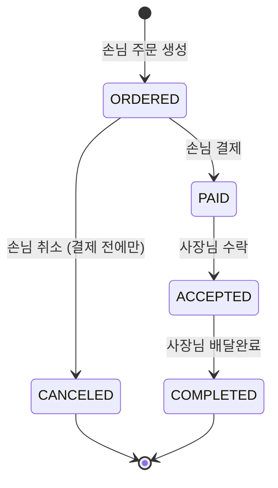

# 🍱 delivery-order-backend

사장님은 **메뉴를 올리고**, 손님은 **주문하고 결제**하고, 사장님이 그 주문을 받아 **처리하는** 작은 배달 주문 서비스의 백엔드 API입니다.

```
👤 회원·로그인 → 🍜 메뉴 → 🧾 주문 → 💳 결제 → ✅ 주문 처리
```

> 온보딩 개인 과제 · 발제 자료: [`docs/20261006 과제 발제 자료.md`](docs/20261006%20과제%20발제%20자료.md)

<br>

## 📌 서비스 전제

- **가게 = 사장님(OWNER) 한 명**입니다. 가게 엔티티를 따로 두지 않습니다.
- **배달 라이더는 없습니다.** 배달 완료 처리까지 사장님이 합니다.
- **결제는 실제 PG와 연동하지 않고**, 결제 내역만 DB에 저장합니다.
- **주문 1건 = 메뉴 1개 + 수량**입니다.
- 화면 없이 **Postman** 등 API 테스트 도구로 확인합니다.

<br>

## 🛠 기술 스택

| 구분 | 사용 기술 |
|---|---|
| Language | Java 21 |
| Framework | Spring Boot 4.1.1 |
| Build | Gradle (Groovy) |
| Database | PostgreSQL 18 (Docker) |
| ORM | Spring Data JPA |
| Security | Spring Security · JWT (JJWT) · BCrypt |
| Etc | Validation · Lombok |

<br>

## 🚀 실행 방법

### 1. PostgreSQL 실행 (Docker)

```bash
# 처음 한 번만
docker run --name delivery-db \
  -e POSTGRES_USER=delivery \
  -e POSTGRES_PASSWORD=delivery1234 \
  -e POSTGRES_DB=delivery \
  -p 5432:5432 -d postgres:18

# 다음부터는
docker start delivery-db
```

> 로컬에 PostgreSQL이 이미 5432 포트를 쓰고 있다면 `-p 5433:5432`로 띄우고 접속 URL 포트도 함께 바꿔 주세요.

### 2. 환경 변수 설정

비밀번호·JWT 비밀키는 저장소에 커밋하지 않습니다.

| 변수 | 설명 | 예시 |
|---|---|---|
| `DB_URL` | DB 접속 URL | `jdbc:postgresql://localhost:5432/delivery` |
| `DB_USERNAME` | DB 계정 | `delivery` |
| `DB_PASSWORD` | DB 비밀번호 | `delivery1234` |
| `JWT_SECRET` | JWT 서명 키 (HS256 · **32바이트 이상**) | — |

### 3. 애플리케이션 실행

```bash
./gradlew bootRun
```

<br>

## 👥 사용자 역할

| 역할 | 누구 | 할 수 있는 것 |
|---|---|---|
| `CUSTOMER` | 손님 | 메뉴 조회 · 주문 생성 · 주문 취소 · 결제 · 내 주문 조회 |
| `OWNER` | 사장님 | 메뉴 등록·수정·삭제 · 내 메뉴에 들어온 주문 조회 · 주문 상태 변경 |

<br>

## ✅ 기능 목록

### 필수 기능

| # | 구분 | 기능 | 권한 | 구현 |
|---|---|---|---|---|
| 1 | 회원 | 회원가입 | 누구나 | ☐ |
| 2 | 회원 | 로그인 (JWT 발급) | 누구나 | ☐ |
| 3 | 메뉴 | 메뉴 등록 | OWNER | ☐ |
| 4 | 메뉴 | 메뉴 목록 조회 | 누구나 | ☐ |
| 5 | 메뉴 | 메뉴 단건 조회 | 누구나 | ☐ |
| 6 | 메뉴 | 메뉴 수정 | OWNER (본인 메뉴) | ☐ |
| 7 | 메뉴 | 메뉴 삭제 (Soft Delete) | OWNER (본인 메뉴) | ☐ |
| 8 | 주문 | 주문 생성 | CUSTOMER | ☐ |
| 9 | 주문 | 주문 목록 조회 (역할별) | 로그인 사용자 | ☐ |
| 10 | 주문 | 주문 취소 | CUSTOMER (본인 주문) | ☐ |
| 11 | 주문 | 주문 상태 변경 | OWNER (본인 메뉴 주문) | ☐ |
| 12 | 결제 | 결제 | CUSTOMER (본인 주문) | ☐ |

### 도전 기능

- [ ] 주문 단건 조회
- [ ] 결제 내역 조회
- [ ] 메뉴 목록 페이징·정렬
- [ ] 주문 생성 후 5분 이내에만 취소 가능
- [ ] 결제 후 취소 · 사장님의 주문 거절
- [ ] 에러 응답 형식 통일 (`@RestControllerAdvice`) + 401 / 403 구분
- [ ] Service 단위 테스트
- [ ] 한 주문에 여러 메뉴 담기 · 가게(Store) 엔티티 분리

<br>

## 🔄 주문 상태 흐름



| 누가 | 허용되는 상태 변경 |
|---|---|
| CUSTOMER | `ORDERED → PAID` (결제) · `ORDERED → CANCELED` (취소) |
| OWNER | `PAID → ACCEPTED` · `ACCEPTED → COMPLETED` |

표에 없는 상태 변경은 모두 거절합니다.

<br>

## 📐 설계 문서

| 문서 | 위치 |
|---|---|
| ERD | _작성 예정_ |
| 테이블 명세서 | _작성 예정_ |
| API 명세서 | _작성 예정_ |
| 인프라 설계도 | _작성 예정_ |

<br>

## 📁 패키지 구조

도메인별로 먼저 나누고, 그 안을 3 Layer(Controller – Service – Repository)로 나눕니다.

```
src/main/java/com/example/delivery
├── global                 # 여러 도메인이 같이 쓰는 것
│   ├── config             # SecurityConfig 등
│   ├── security           # JwtUtil, JwtAuthenticationFilter
│   └── entity             # BaseEntity (JPA Auditing)
├── user                   # 회원 · 인증
│   ├── controller
│   ├── service
│   ├── repository
│   ├── entity
│   └── dto (request / response)
├── menu                   # user와 같은 구조
├── order                  # user와 같은 구조
├── payment                # user와 같은 구조
└── DeliveryApplication.java
```

<br>

## 🌿 브랜치 전략

1인 개발이고 기간이 짧은 과제라 **GitHub Flow**를 씁니다. 배포가 없으므로 `develop` · `release` · `hotfix` 브랜치는 두지 않습니다.

```
main ──●────────●────────●────────●────────●────────●──── (v1.0) ───●──
        \      / \      / \      / \      / \      /               /
         docs/   chore/    feat/    feat/    feat/     ...   feat/challenge-*
         design  init-     auth     menu     order
                 setup                        └─ 다음: feat/payment
```

### 브랜치 목록

| 순서 | 브랜치 | 작업 범위 | 관련 기능 |
|---|---|---|---|
| 0 | `docs/design` | ERD · 테이블 명세서 · API 명세서 · 인프라 설계도 | — |
| 1 | `chore/init-setup` | `application.yml` · 비밀값 분리 · `BaseEntity` + `@EnableJpaAuditing` · 공통 예외 골격 | — |
| 2 | `feat/auth` | User 엔티티 · 회원가입 · 로그인 · JWT 필터 · `SecurityConfig` | #1 ~ #2 |
| 3 | `feat/menu` | 메뉴 CRUD · Soft Delete · 본인 메뉴 검증 | #3 ~ #7 |
| 4 | `feat/order` | 주문 생성 · 역할별 목록 · 취소 · 상태 변경(상태 전이 규칙) | #8 ~ #11 |
| 5 | `feat/payment` | 결제 · 주문 상태 결제완료로 변경 · 결제 완료 1회 보장 | #12 |
| 6~ | `feat/challenge-*` | 도전 기능을 하나씩 (예: `feat/challenge-paging`) | 도전 기능 |

### 운영 규칙

- 모든 브랜치는 **`main`에서 따고 `main`으로 merge**합니다.
- **한 번에 브랜치 하나만** 작업합니다. merge한 뒤 다음 브랜치를 땁니다.
- `feat/payment`는 Order 엔티티와 상태 enum에 의존하므로 **`feat/order`를 merge한 다음에** 시작합니다.
- 혼자 하더라도 **PR을 열어 merge**합니다. PR 본문에는 해당 기능의 체크리스트와 Postman 확인 결과를 남깁니다.
- merge 방식은 **Squash and merge**를 씁니다. `main`에는 기능 단위 커밋만 남깁니다.
- 필수 기능 12개를 모두 끝낸 시점에 **`v1.0` 태그**를 붙입니다.

### 브랜치 이름 규칙

```
<type>/<short-description>
```

| type | 용도 |
|---|---|
| `feat` | 새 기능 |
| `fix` | 버그 수정 |
| `refactor` | 동작 변경 없는 코드 개선 |
| `docs` | 문서 |
| `chore` | 설정 · 빌드 · 기타 |
| `test` | 테스트 코드 |

### 커밋 메시지 규칙

```
<type>: <요약>

예) feat: 메뉴 등록 API 구현
    fix: 결제 완료된 주문이 취소되는 문제 수정
    docs: ERD 추가
```
