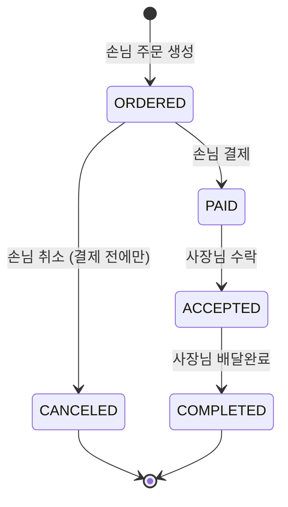
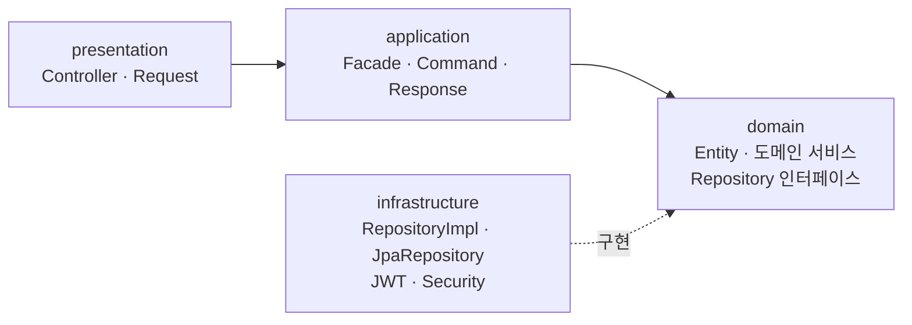

# 🍱 delivery-order-backend

사장님은 **메뉴를 올리고**, 손님은 **주문하고 결제**하고, 사장님이 그 주문을 받아 **처리하는** 작은 배달 주문 서비스의 백엔드 API입니다.

```
👤 회원·로그인 → 🍜 메뉴 → 🧾 주문 → 💳 결제 → ✅ 주문 처리
```

| 결과 요약 | |
|---|---|
| 필수 기능 | **12개 모두 구현** |
| 테스트 시나리오 | 발제 5-1의 **#1~#39 전체를 E2E 테스트로 자동 검증** |
| 테스트 | **224개** 통과 (도메인 · 도메인 서비스 · Facade · Repository · E2E) — 모두 TDD로 작성 |
| 구조 | 모놀리식 + **4계층 레이어드 아키텍처** (presentation · application · domain · infrastructure) |
| 동시성 | 같은 주문에 결제 요청이 동시에 와도 **결제 기록은 항상 1건** (낙관적 락) |

<br>

## 목차

1. [서비스 전제](#-서비스-전제)
2. [기술 스택](#-기술-스택)
3. [실행 방법](#-실행-방법)
4. [구현 기능](#-구현-기능)
5. [주문 상태 흐름](#-주문-상태-흐름)
6. [아키텍처](#-아키텍처)
7. [주요 설계 결정](#-주요-설계-결정)
8. [테스트](#-테스트)
9. [발제 점검표 대응](#-발제-점검표-대응)
10. [설계 문서](#-설계-문서)
11. [개발 과정](#-개발-과정)
12. [알려진 한계](#-알려진-한계)
13. [회고](#-회고)

<br>

## 📌 서비스 전제

- **가게 = 사장님(OWNER) 한 명**입니다. 가게 엔티티를 따로 두지 않습니다.
- **배달 라이더는 없습니다.** 배달 완료 처리까지 사장님이 합니다.
- **결제는 실제 PG와 연동하지 않고**, 결제 내역만 DB에 저장합니다.
- **주문 1건 = 메뉴 1개 + 수량**입니다.
- 화면 없이 **Postman** 등 API 테스트 도구로 확인합니다.

<br>

## 🛠 기술 스택

| 구분 | 사용 기술 |
|---|---|
| Language | Java 21 |
| Framework | Spring Boot 4.1.1 |
| Build | Gradle (Groovy) |
| Database | PostgreSQL 18 (Docker Compose) |
| ORM | Spring Data JPA |
| Security | Spring Security · JWT (JJWT 0.13, HS256) · BCrypt |
| Test | JUnit 5 · AssertJ · Mockito · MockMvc · Testcontainers 2.x (PostgreSQL) |
| Etc | Validation · Lombok |

<br>

## 🚀 실행 방법

### 사전 준비

- JDK 21
- Docker Desktop (실행 중이어야 합니다. `docker ps`로 확인)

### 테스트만 돌려 보기

테스트는 **Testcontainers**가 PostgreSQL 컨테이너를 직접 띄우므로, Docker만 켜져 있으면 `.env` 없이 바로 실행됩니다.

```bash
./gradlew test
```

### 애플리케이션 실행

**1. 환경 변수 파일 만들기** — 비밀번호·JWT 비밀키는 저장소에 커밋하지 않습니다. `.env`는 `.gitignore`에 포함되어 있습니다.

```bash
cp .env.example .env
```

| 변수 | 설명 | 예시 |
|---|---|---|
| `DB_URL` | DB 접속 URL | `jdbc:postgresql://localhost:5432/delivery` |
| `DB_USERNAME` | DB 계정 | `delivery` |
| `DB_PASSWORD` | DB 비밀번호 | `delivery1234` |
| `JWT_SECRET` | JWT 서명 키 (HS256 · **32바이트 이상**) | `openssl rand -base64 48`로 생성 |

**2. PostgreSQL 실행** — `docker compose`는 같은 폴더의 `.env`를 자동으로 읽어 DB 계정을 만듭니다.

```bash
docker compose up -d     # 실행
docker compose ps        # 상태 확인 (STATUS: Up)
```

| 상황 | 명령 | 데이터 |
|---|---|---|
| 끄기 | `docker compose stop` | 유지 |
| DB 초기화 | `docker compose down -v` | **삭제** |
| DB 직접 접속 | `docker compose exec db psql -U delivery -d delivery` | — |

> 로컬에 PostgreSQL이 이미 5432 포트를 쓰고 있다면 `docker-compose.yml`의 포트를 `"5433:5432"`로 바꾸고 `.env`의 `DB_URL` 포트도 함께 바꿔 주세요.

**3. 애플리케이션 실행** — Spring Boot는 `.env`를 자동으로 읽지 않으므로 셸에 불러온 뒤 실행합니다.

```bash
set -a; source .env; set +a
./gradlew bootRun
```

IntelliJ에서는 `.env` 내용을 한 줄로 복사(`paste -sd';' .env | pbcopy`)해 실행 구성의 **환경 변수**에 붙여 넣습니다.

<br>

## ✅ 구현 기능

### 필수 기능 12개

| # | 기능 | Method · URL | 권한 | 성공 |
|---|---|---|---|---|
| 1 | 회원가입 | `POST /api/auth/signup` | 누구나 | 201 |
| 2 | 로그인 (JWT 발급) | `POST /api/auth/login` | 누구나 | 200 |
| 3 | 메뉴 등록 | `POST /api/menus` | OWNER | 201 |
| 4 | 메뉴 목록 조회 | `GET /api/menus?page=0&size=10` | 누구나 | 200 |
| 5 | 메뉴 단건 조회 | `GET /api/menus/{menuId}` | 누구나 | 200 |
| 6 | 메뉴 수정 | `PUT /api/menus/{menuId}` | OWNER · 본인 메뉴 | 200 |
| 7 | 메뉴 삭제 (Soft Delete) | `DELETE /api/menus/{menuId}` | OWNER · 본인 메뉴 | 204 |
| 8 | 주문 생성 | `POST /api/orders` | CUSTOMER | 201 |
| 9 | 주문 목록 조회 (역할별) | `GET /api/orders` | 로그인 사용자 | 200 |
| 10 | 주문 취소 | `PATCH /api/orders/{orderId}/cancel` | CUSTOMER · 본인 주문 | 200 |
| 11 | 주문 수락 · 배달완료 | `PATCH /api/orders/{orderId}/accept` · `/complete` | OWNER · 본인 메뉴 주문 | 200 |
| 12 | 결제 | `POST /api/orders/{orderId}/payments` | CUSTOMER · 본인 주문 | 201 |

- 인증이 필요한 API는 `Authorization: Bearer {accessToken}` 헤더를 붙입니다. 토큰은 로그인 응답 본문으로 받고 1시간 동안 유효합니다.
- 주문 목록은 손님이면 **내가 한 주문**, 사장님이면 **내 메뉴에 들어온 주문**(삭제된 메뉴의 주문 포함)을 최신순으로 보여 줍니다.
- 성공 응답은 데이터를 그대로 담고, 에러는 모두 같은 형식(`status`·`code`·`message`·`fieldErrors`)으로 응답합니다. 요청·응답 필드와 에러 코드 전체는 [API 명세서](docs/design/03-api-spec.md)에 있습니다.

### 도전 기능

| 기능 | 상태 |
|---|---|
| 메뉴 목록 페이징·정렬 | ✅ 기본 10개·최대 50개, 최신 등록순 고정. Spring `Page`를 그대로 내보내지 않고 `PageResponse`로 감쌈 |
| Service 단위 테스트 (성공·실패) | ✅ 도메인 서비스·Facade 단위 테스트 ([테스트](#-테스트) 참고) |
| 에러 응답 형식 통일 (`@RestControllerAdvice`) | ✅ `GlobalExceptionHandler` · `ErrorResponse` |
| 401 / 403 구분 | ⬜ 토큰이 없거나 잘못되면 지금은 본문 없는 **403** ([알려진 한계](#-알려진-한계)) |
| 주문 단건 조회 · 결제 내역 조회 | ⬜ |
| 주문 생성 후 5분 이내에만 취소 | ⬜ |
| 결제 후 취소 · 사장님의 주문 거절 | ⬜ |
| 한 주문에 여러 메뉴 · 가게 엔티티 분리 | ⬜ |

<br>

## 🔄 주문 상태 흐름



| 누가 | 허용되는 상태 변경 |
|---|---|
| CUSTOMER | `ORDERED → PAID` (결제) · `ORDERED → CANCELED` (취소) |
| OWNER | `PAID → ACCEPTED` (수락) · `ACCEPTED → COMPLETED` (배달완료) |

표에 없는 상태 변경은 모두 **409 `INVALID_ORDER_STATUS`** 로 거절합니다. 이 규칙은 `Order` 엔티티의 상태 변경 메서드(`pay`·`cancel`·`accept`·`complete`)가 직접 검사합니다.

검증 순서는 **404(없음) → 403(남의 것) → 409(상태)** 입니다. 남의 주문이면 상태와 상관없이 403이라, 다른 사람 주문의 상태가 새어 나가지 않습니다.

<br>

## 🏛 아키텍처

### 왜 4계층인가

발제는 3 Layer(Controller – Service – Repository)를 제시하지만, **레이어드 아키텍처를 깊이 학습하기 위해 4계층으로 진행**했습니다. 3 Layer에서 Service 하나가 맡던 일을 둘로 나눈 구조입니다.



| 계층 | 맡는 일 | 하지 않는 일 |
|---|---|---|
| **presentation** | HTTP 요청·응답, `@Valid` 입력 검증, 상태 코드 결정 | 비즈니스 판단, Repository 호출 |
| **application** | 유스케이스 흐름: 트랜잭션, 도메인 서비스 호출 순서, 기술 처리(암호화·토큰), 엔티티 → 응답 DTO 변환 | 상태 전이·금액 계산 같은 규칙 |
| **domain** | 비즈니스 규칙: 엔티티 메서드(상태 전이·총액·소유 확인), 도메인 서비스(조회·404·403·저장), Repository **인터페이스** | Spring Web·Security·JWT·Spring Data JPA 의존 |
| **infrastructure** | 기술 구현: Repository 구현(Spring Data JPA), JWT 발급·검증, Security 설정 | 비즈니스 규칙 |

**발제 5-2 "Controller는 Service를, Service는 Repository를 부른다"는 그대로 지켜집니다.** 호출은 `Controller → Facade → 도메인 서비스 → Repository`로 한 방향이고, Controller가 Repository를 직접 부르는 곳은 없습니다.

### 예: 결제 한 번이 지나가는 길

```
PaymentController      @Valid로 결제 수단 검증 → paymentFacade.pay(userId, orderId, command)
  └ PaymentFacade      @Transactional — 순서만 조율
      ├ OrderService   주문 조회 (없으면 404) → 본인 주문인지 확인 (아니면 403)
      └ PaymentService order.pay() (ORDERED가 아니면 409) → Payment.complete(order) → 저장
```

여러 도메인이 엮이는 유스케이스(주문 생성 = 메뉴 + 회원 + 주문, 결제 = 주문 + 결제)를 Facade가 조율하고, "없는 주문 404 → 남의 주문 403" 같은 작업은 도메인 서비스 하나를 주문·결제가 함께 재사용합니다.

### 의존성 역전 (DIP)

핵심 계층(domain·application)이 기술 세부에 기대지 않도록, **쓰는 쪽이 인터페이스를 정하고 infrastructure가 구현**합니다.

| 인터페이스 (쓰는 쪽) | 구현 (infrastructure) |
|---|---|
| `OrderRepository` 등 4개 (domain) | `OrderRepositoryImpl` → `OrderJpaRepository extends JpaRepository` |
| `TokenProvider` (application) | `JwtProvider` |

그래서 domain에는 infrastructure import가 하나도 없고, 도메인 서비스·Facade 테스트는 인터페이스만 Mock으로 바꿔 끼웁니다.

### 패키지 구조

도메인별로 먼저 나누고, 그 안을 4계층으로 나눕니다.

```
src/main/java/com/example/delivery
├── global                      # 여러 도메인이 함께 쓰는 것
│   ├── presentation            # GlobalExceptionHandler, ErrorResponse
│   ├── application/dto         # PageResponse
│   ├── domain                  # BaseEntity(JPA Auditing), BusinessException, ErrorCode
│   └── infrastructure          # SecurityConfig, JwtProvider, JwtAuthenticationFilter, AuthUser, Clock·Auditing 설정
├── user                        # 회원 · 인증
│   ├── presentation            # UserController, SignupRequest, LoginRequest
│   ├── application             # UserFacade, TokenProvider, dto/(Command·Response)
│   ├── domain                  # User, UserRole, UserStatus, UserService, UserRepository
│   └── infrastructure          # UserJpaRepository, UserRepositoryImpl
├── menu                        # user와 같은 구조
├── order                       # user와 같은 구조
├── payment                     # user와 같은 구조
└── DeliveryApplication.java
```

도메인 사이의 의존은 `payment → order → menu → user` 한 방향뿐입니다. 연관관계는 모두 `@ManyToOne(fetch = LAZY)` 단방향이고 `@OneToMany` 컬렉션은 두지 않습니다.

<br>

## 🧭 주요 설계 결정

결정마다 [설계 문서](#-설계-문서)에 `D-xx` 번호로 이유와 포기한 것을 기록했습니다. 그중 리뷰할 때 궁금할 만한 것만 모았습니다.

| 결정 | 선택 | 이유 |
|---|---|---|
| 결제 1회 보장 ([02 D-04](docs/design/02-domain.md)) | 주문 상태 검사 + `Order`의 **`@Version` 낙관적 락** | 순차 재결제는 상태 검사(409)가 막고, 동시에 들어온 요청은 나중에 커밋하는 쪽이 버전 충돌로 롤백되며 그 결제 기록도 함께 사라집니다. 충돌 예외는 409 `CONCURRENT_MODIFICATION`으로 변환합니다 |
| 금액 계산 | **서버가 계산**, 요청으로 받지 않음 | 총액 = 메뉴 가격 × 수량은 `Order.create()`가, 결제 금액은 `Payment.complete()`가 주문 총액에서 가져옵니다. 요청에 금액을 넣어도 무시하는 것을 E2E로 확인합니다 |
| 주문 스냅샷 ([02 D-06](docs/design/02-domain.md)) | 주문 시점의 메뉴 이름·가격을 **주문에 복사** | 메뉴가 수정·삭제돼도 주문 내역은 주문 당시 그대로 보입니다 |
| 메뉴 삭제 ([02 D-05](docs/design/02-domain.md)) | **Soft Delete** (`deleted_at`) | 기존 주문 기록을 지키기 위해 행을 남깁니다. 삭제된 메뉴는 목록에서 빠지고, 단건 조회·수정·삭제·주문에서는 404입니다 |
| "누가" 요청했는지 | 요청 본문이 아니라 **JWT에서** 꺼냄 | 토큰에는 `sub`(회원 PK)·`username`·`role`·`exp`만 담고, 인증 필터는 DB 조회 없이 인증 정보를 만듭니다 |
| 규칙의 위치 ([04 D-11](docs/design/04-class-diagram.md)) | 상태 규칙(409)은 **엔티티**, 존재(404)·소유(403)는 **도메인 서비스** | 엔티티는 `isOwnedBy()` 같은 판단 근거만 주고, 예외는 Repository를 가진 도메인 서비스가 던져 여러 Facade가 재사용합니다 |
| enum 노출 범위 ([04 D-32](docs/design/04-class-diagram.md)) | domain enum은 application 밖으로 내보내지 않음 | 요청·응답의 역할·상태는 문자열이고 `@Pattern`으로 검증합니다. 잘못된 값은 어느 필드가 틀렸는지 담긴 400으로 응답됩니다 |
| 비밀번호 저장 ([02 D-14](docs/design/02-domain.md)) | `BCryptPasswordEncoder`를 **직접** 빈으로 등록 | 기본 위임 인코더는 `{bcrypt}` 접두사를 붙여, 저장값이 `$2`로 시작해야 한다는 점검 항목을 통과하지 못합니다 |

<br>

## 🧪 테스트

### TDD

**모든 기능을 TDD로 구현했습니다.** 실패하는 테스트를 먼저 쓰고, **컴파일 에러가 아니라 단언 실패로** Red가 나는지 확인한 뒤 구현했습니다. 기능 하나를 **안에서 바깥으로** 진행합니다.

```
① 도메인(엔티티)  →  ② 도메인 서비스 · Facade  →  ③ Repository  →  ④ E2E
```

### 계층별 테스트 (224개)

| 대상 | 방식 | 개수 | 검증하는 것 |
|---|---|---|---|
| 도메인 (엔티티) | 순수 JUnit — Spring·DB 없음 | 46 | 상태 전이와 409(허용되지 않는 전이 16가지 전부), 총액 계산, 스냅샷, 소유 확인 |
| 도메인 서비스 | Mockito — Repository만 Mock, 엔티티는 진짜 객체 | 41 | 404 → 403 → 409 순서, 여러 규칙을 동시에 어긴 경우, 거절 시 저장하지 않음 |
| Facade | Mockito — 도메인 서비스·`PasswordEncoder`·`TokenProvider` Mock | 7 | 여러 도메인을 엮는 호출 순서, 암호화·토큰 발급 |
| infrastructure | `@DataJpaTest` + Testcontainers, 순수 JUnit(JWT) | 34 | 직접 만든 Query Method, 정렬, N+1 방지, enum 문자열 저장, JWT 만료·변조 |
| E2E | `@SpringBootTest` + MockMvc + Testcontainers | 95 | 발제 시나리오 #1~#39, 401·403·400, 동시 결제, Security 설정 함정 |
| 예외 변환 | standalone MockMvc | 1 | 낙관적 락 충돌 → 409 |

- 테스트 DB는 H2가 아니라 운영과 같은 **PostgreSQL**(Testcontainers)입니다.
- E2E는 `@Transactional` 롤백을 쓰지 않고 **테스트마다 테이블을 비웁니다.** 롤백이 지연 로딩·제약 위반 문제를 숨기지 않게 하기 위해서입니다.
- 현재 시각이 필요한 코드(JWT 만료, 메뉴 삭제 시각)는 `Clock`을 주입받아 테스트에서 시각을 고정합니다.

### 동시 결제 검증

동시성은 두 가지 테스트로 확인합니다.

1. **실제 동시 요청** (`PaymentApiTest`) — 스레드 2개로 같은 주문을 동시에 결제하면 응답은 201·409가 하나씩이고, 결제 기록은 1건입니다.
2. **충돌을 항상 재현** (`OrderOptimisticLockTest`) — 1번은 타이밍에 따라 낙관적 락이 아니라 상태 검사로 끝날 수 있습니다. 그래서 트랜잭션 두 개를 일부러 겹쳐, 나중에 커밋하는 쪽이 **항상** 버전 충돌로 롤백되는지 확인합니다.

<br>

## 📋 발제 점검표 대응

### 5-1 테스트 시나리오 #1~#39

Postman으로 순서대로 확인하는 시나리오 39개를 모두 E2E 테스트로 옮겼습니다. 테스트 이름(`@DisplayName`)에 시나리오 번호가 붙어 있습니다.

| 시나리오 | 내용 | 테스트 |
|---|---|---|
| #1~#8 | 회원가입 · 로그인 | `UserApiTest` |
| #9~#16 | 메뉴 등록 · 조회 · 수정 | `MenuApiTest` |
| #17~#22 | 주문 생성 · 역할별 목록 · 결제 전 수락 | `OrderApiTest` |
| #23~#26 | 결제 · 재결제 · 결제 후 취소 | `PaymentApiTest` |
| #27~#29 | 수락 · 배달완료 | `OrderApiTest` |
| #30~#33 | 주문 취소 · 취소된 주문 결제 | `OrderApiTest`, `PaymentApiTest` |
| #34~#39 | 메뉴 Soft Delete · 삭제 후 주문 기록 유지 | `MenuApiTest`, `OrderApiTest` |

### 5-2 코드 점검 체크리스트

| 항목 | 위치 |
|---|---|
| 연관관계 4개가 `@ManyToOne` + `LAZY` | `Menu.owner`, `Order.customer`, `Order.menu`, `Payment.order` |
| `BaseEntity`(`@MappedSuperclass`) + `@EnableJpaAuditing` | `global/domain/BaseEntity`, `global/infrastructure/config/JpaAuditingConfig` |
| 필수 컬럼 `nullable = false`, 아이디 `unique = true` | 각 엔티티. 아이디 UNIQUE는 `UserJpaRepositoryTest`가 DB 제약으로 확인 |
| enum은 `@Enumerated(EnumType.STRING)` | `UserRole`·`UserStatus`·`MenuStatus`·`OrderStatus`·`PaymentMethod`·`PaymentStatus` |
| Controller → Service → Repository | Controller → Facade → 도메인 서비스 → Repository ([아키텍처](#-아키텍처)) |
| 응답은 DTO, 비밀번호 필드 없음 | `application/dto/*Response`. `UserApiTest`가 응답에 비밀번호가 없는지 확인 |
| 요청 DTO 검증 + `@Valid` | `presentation/*Request` + Controller의 `@Valid` |
| 아이디 중복 확인·역할별 주문 목록이 Query Methods | `UserJpaRepository.existsByUsername`, `OrderJpaRepository.findAllByCustomerId…`·`findAllByMenuOwnerId…` |
| 메뉴 삭제가 삭제 표시 | `Menu.delete(LocalDateTime)` — `DELETE` 쿼리 없음 |
| 비밀번호·JWT 비밀키를 올리지 않음 | `application.yml`은 `${DB_PASSWORD}`·`${JWT_SECRET}` 환경 변수만 참조, `.env`는 git 제외. 테스트 설정의 키는 테스트 전용 값 |

<br>

## 📐 설계 문서

코드를 짜기 전에 설계 문서를 먼저 쓰고, 구현하면서 바뀐 결정은 같은 PR에서 문서에 반영했습니다. 각 문서는 결정마다 **선택 · 이유 · 포기한 것**을 남깁니다.

| # | 문서 | 내용 |
|---|---|---|
| 01 | [요구사항 정의서](docs/design/01-requirements.md) | 기능 요구사항, 권한 매트릭스, 검증 순서, 정책 결정 |
| 02 | [도메인 설계](docs/design/02-domain.md) | ERD, 테이블 명세서, 동시성·Soft Delete·스냅샷 결정 |
| 03 | [API 명세서](docs/design/03-api-spec.md) | URL, 요청·응답, 상태 코드, 에러 코드 |
| 04 | [클래스 다이어그램](docs/design/04-class-diagram.md) | 도메인 모델, 4계층 구조, 엔티티 메서드, 에러 코드 |
| 05 | [시퀀스 다이어그램](docs/design/05-sequence-diagram.md) | 로그인·인증 필터, 주문 생성, 결제(동시 결제 포함) |
| 06 | [아키텍처 구성도](docs/design/06-architecture.md) | 실행 환경, 요청 흐름, 테스트 환경 |
| 07 | [테스트 전략](docs/design/07-test-strategy.md) | TDD 진행 순서, 계층별 테스트 방식 |
| — | [구현 계획](docs/implementation-plan.md) | 단계별 체크리스트와 진행 기록 |

<br>

## 🌿 개발 과정

1인 개발 · 짧은 기간이라 **GitHub Flow**를 썼습니다. `main`에서 `<type>/<설명>` 브랜치를 따서 PR을 열고 **Squash merge**했습니다.

| PR | 브랜치 | 내용 |
|---|---|---|
| #1 · #3 | `docs/design` | 설계 문서 01~07 |
| #2 | `chore/init-setup` | Docker Compose, 비밀값 분리(`.env`), `BaseEntity`·JPA Auditing, 공통 예외 처리 |
| #4 | `feat/auth` | 테스트 환경(Testcontainers), 회원가입·로그인, JWT·Security |
| #5 | `feat/menu` | 메뉴 CRUD, Soft Delete, 페이징 |
| #6 | `refactor/layered-architecture` | ① 4계층 구조 바로잡기 |
| #7 | `feat/order` | 주문 생성·목록·취소·수락·배달완료 |
| #8 | `refactor/token-provider` | ② 토큰 발급 추상화 (DIP) |
| #9 | `feat/payment` | 결제, 동시 결제 방지 → **`v1.0`** (필수 기능 완료) |

구현 중 구조를 점검해 **리팩터링을 두 번** 했습니다. 기존 테스트를 안전망으로 동작이 그대로인지 확인하며 진행했습니다.

1. **4계층 바로잡기 (#6)** — 메뉴까지 만든 뒤 보니 Repository(`JpaRepository` 상속)가 domain에 있어 domain이 DB 기술에 묶여 있었고, Service가 presentation의 DTO를 import해 계층이 서로를 알고 있었습니다. Repository를 domain 인터페이스 + infrastructure 구현으로 나누고, DTO를 application으로 옮기고, Service를 Facade(유스케이스 조율)와 도메인 서비스(조회·404·403·저장)로 나눴습니다.
2. **토큰 발급 추상화 (#8)** — DIP 관점에서 다시 점검해 보니 `UserFacade`(application)가 `JwtProvider`(infrastructure) 구체 클래스를 직접 쓰고 있었습니다. application에 `TokenProvider` 인터페이스를 두고 `JwtProvider`가 구현하게 바꿨습니다.

<br>

## 🚧 알려진 한계

| 내용 | 이유 · 대응 |
|---|---|
| 토큰이 없거나 만료·변조되면 **본문 없는 403**으로 응답 | 401/403 구분은 도전 기능이라 적용하지 않았습니다. `AuthenticationEntryPoint`·`AccessDeniedHandler`를 등록하면 `ErrorResponse` 형식의 401·403으로 바꿀 수 있습니다 |
| 메뉴 수정·주문 상태 변경 응답의 `updatedAt`이 변경 전 시각 | 수정 시각은 DB에 반영(flush)될 때 기록되는데, 응답 DTO는 커밋 전에 만들어집니다. DB에 저장되는 값은 정확합니다 |
| 주문 목록은 페이징하지 않음 | 요구사항 범위에서는 전체 목록. 필요하면 메뉴 목록과 같은 `PageResponse`를 적용합니다 |
| 메뉴 품절 처리·회원 탈퇴 API 없음 | `menus.status`·`users.status` 컬럼과 규칙(품절 주문 409, 탈퇴 회원 로그인 401)만 확장 대비로 두었습니다 |

<br>

## 💭 회고

### 레이어드 아키텍처: "이름만 4계층"에서 실제 4계층으로

가장 오래 고민한 것은 계층 구조였습니다. 회원·메뉴까지 만든 뒤 점검해 보니 **패키지는 네 개였지만 실제 책임은 Controller → Service → Repository 3계층 그대로**였습니다. infrastructure는 JWT와 Security 설정만 맡았고, DB 접근은 domain에 있었습니다.

이를 바로잡으면서 다섯 가지 질문을 차례로 풀었습니다. 자세한 과정은 [레이어드 아키텍처 고민 기록](docs/blog/layered-architecture-retrospective.md)에 정리했습니다.

| 질문 | 선택 | 포기한 것 |
|---|---|---|
| DB에 접근하는 코드는 어느 계층에? | 인터페이스는 domain, 구현은 infrastructure | `JpaRepository` 상속 인터페이스 하나의 간결함 |
| application이 presentation의 DTO를 알아도 되나? | application이 Command·Response를 소유, Controller가 `toCommand()` | Request를 그대로 넘기는 간결함 |
| 패키지는 도메인 먼저인가, 계층 먼저인가? | 도메인 먼저, 그 안을 계층별로 | 4계층이 최상위 폴더에 바로 보이는 명확함 |
| Service는 domain에 가야 하나? | application은 Facade, domain에 도메인 서비스 | 클래스 하나의 간결함, 단순 CRUD의 통과용 코드 |
| 도메인 모델은 어디까지 밖으로 나가도 되나? | 엔티티뿐 아니라 domain enum도 밖으로 내보내지 않음 | enum을 DTO에 그대로 쓰는 간결함 |

여기에 주문까지 만든 뒤 **DIP 관점으로 한 번 더 점검**했고, `UserFacade`가 `JwtProvider` 구체 클래스를 직접 쓰는 곳 하나를 `TokenProvider` 인터페이스로 바꿨습니다.

이 과정에서 배운 것:

- **"Service = 비즈니스 계층"이라는 3계층식 이해가 4계층에서는 맞지 않았습니다.** 비즈니스 규칙은 엔티티로 내려가고, 서비스는 유스케이스를 지휘하는 Facade(application)와 도메인 단위 작업을 맡는 도메인 서비스(domain)로 나뉩니다. Service를 그냥 domain으로 옮기면 트랜잭션·DTO·암호화 같은 기술이 domain에 따라 들어가, 방금 고친 문제가 다시 생깁니다.
- **계층의 경계는 패키지 이름이 아니라 import 방향으로 드러났습니다.** "application → presentation import 7곳", "presentation → domain import 1곳"처럼 import를 세어 보니, 구조가 맞는지 감이 아니라 숫자로 확인할 수 있었습니다. 리팩터링 후에는 모두 0곳입니다.
- **경계를 분명하게 할 때마다 간결함을 내줬습니다.** 인터페이스·Command·Facade가 늘어 단순 CRUD에서는 통과용 코드가 생깁니다. 이번에는 학습 목적이라 경계 쪽을 골랐고, 무엇을 포기했는지를 설계 문서에 함께 남겼습니다. 실무라면 기능 규모에 따라 다르게 판단할 수 있는 부분이라고 생각합니다.
- **주문·결제처럼 여러 도메인이 엮이는 기능에서 구조를 바꾼 효과가 드러났습니다.** "없는 주문 404 → 남의 주문 403"을 `OrderService` 한 곳에 두고 주문 취소와 결제가 함께 썼고, 결제 Facade는 순서 조율 몇 줄로 끝났습니다.

### 테스트가 리팩터링을 가능하게 했다

두 번의 큰 구조 변경은 모두 **기존 테스트를 그대로 두고 코드 위치만 옮기는** 방식으로 했습니다. 테스트가 통과하는 상태를 유지하며 한 단계씩 옮겼기 때문에, 바꿀 때마다 동작이 그대로인지 바로 확인할 수 있었습니다. TDD로 미리 쌓아 둔 테스트가 구조를 과감하게 바꿀 수 있는 안전망이 됐습니다.

TDD를 하면서 신경 쓴 점과 알게 된 점:

- **Red는 "기대한 이유로" 실패해야 의미가 있었습니다.** 컴파일 에러를 Red로 치지 않으려고, 빈 껍데기 클래스를 먼저 두고 단언 실패를 확인한 뒤 구현했습니다. 반대로 처음부터 통과한 테스트는 왜 통과했는지(이미 Security가 막고 있음 등)를 확인하고 넘어갔습니다.
- **동시성은 "통과했다"만으로 안심할 수 없었습니다.** 스레드 2개로 동시 결제를 보내는 테스트는 통과했지만, 타이밍에 따라 낙관적 락이 아니라 상태 검사(409)로 끝날 수도 있다는 걸 알게 됐습니다. 그래서 트랜잭션 두 개를 일부러 겹쳐 락 충돌을 항상 재현하는 테스트를 따로 만들었습니다.
- **테스트 이름에 시나리오 번호를 붙여 두니 빠진 곳이 보였습니다.** 마지막에 #1~#39를 대조해 보니 손님 가입(#3·#4)을 직접 검증하는 테스트가 없어서 추가했습니다.
