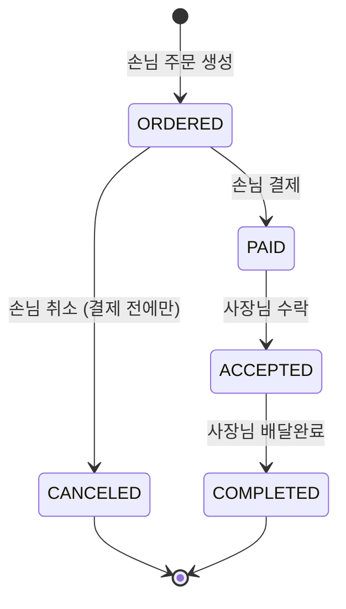

# 🍱 delivery-order-backend

사장님은 **메뉴를 올리고**, 손님은 **주문하고 결제**하고, 사장님이 그 주문을 받아 **처리하는** 작은 배달 주문 서비스의 백엔드 API입니다.

```
👤 회원·로그인 → 🍜 메뉴 → 🧾 주문 → 💳 결제 → ✅ 주문 처리
```


<br>

## 📌 서비스 전제

- **가게 = 사장님(OWNER) 한 명**입니다. 가게 엔티티를 따로 두지 않습니다.
- **배달 라이더는 없습니다.** 배달 완료 처리까지 사장님이 합니다.
- **결제는 실제 PG와 연동하지 않고**, 결제 내역만 DB에 저장합니다.
- **주문 1건 = 메뉴 1개 + 수량**입니다.
- 화면 없이 **Postman** 등 API 테스트 도구로 확인합니다.

<br>

## 🛠 기술 스택

| 구분 | 사용 기술 |
|---|---|
| Language | Java 21 |
| Framework | Spring Boot 4.1.1 |
| Build | Gradle (Groovy) |
| Database | PostgreSQL 18 (Docker) |
| ORM | Spring Data JPA |
| Security | Spring Security · JWT (JJWT) · BCrypt |
| Etc | Validation · Lombok |

<br>

## 🚀 실행 방법

### 사전 준비

- JDK 21
- Docker Desktop (실행 중이어야 합니다. `docker ps`로 확인)

### 1. 환경 변수 파일 만들기

비밀번호·JWT 비밀키는 저장소에 커밋하지 않습니다. 예시 파일을 복사해 `.env`를 만들고 값을 채웁니다. `.env`는 `.gitignore`에 포함되어 있습니다.

```bash
cp .env.example .env
```

| 변수 | 설명 | 예시 |
|---|---|---|
| `DB_URL` | DB 접속 URL | `jdbc:postgresql://localhost:5432/delivery` |
| `DB_USERNAME` | DB 계정 | `delivery` |
| `DB_PASSWORD` | DB 비밀번호 | `delivery1234` |
| `JWT_SECRET` | JWT 서명 키 (HS256 · **32바이트 이상**) | `openssl rand -base64 48`로 생성 |

### 2. PostgreSQL 실행 (Docker Compose)

`docker compose`는 같은 폴더의 `.env`를 자동으로 읽어 DB 계정을 만듭니다.

```bash
docker compose up -d     # 실행
docker compose ps        # 상태 확인 (STATUS: Up)
```

| 상황 | 명령 | 데이터 |
|---|---|---|
| 끄기 | `docker compose stop` | 유지 |
| 컨테이너 내리기 | `docker compose down` | 유지 |
| DB 초기화 | `docker compose down -v` | **삭제** |
| DB 직접 접속 | `docker compose exec db psql -U delivery -d delivery` | — |

> 로컬에 PostgreSQL이 이미 5432 포트를 쓰고 있다면 `docker-compose.yml`의 포트를 `"5433:5432"`로 바꾸고 `.env`의 `DB_URL` 포트도 함께 바꿔 주세요.

### 3. 애플리케이션 실행

Spring Boot는 `.env`를 자동으로 읽지 않으므로 환경 변수를 직접 넘겨야 합니다.

**터미널**

```bash
set -a; source .env; set +a
./gradlew bootRun
```

**IntelliJ**

1. `.env` 내용을 한 줄로 복사합니다: `paste -sd';' .env | pbcopy`
2. 실행/디버그 구성 → `DeliveryApplication` → **환경 변수**에 붙여 넣습니다.
3. 테스트도 DB가 필요하므로 **구성 템플릿 편집 → Gradle**의 환경 변수에도 똑같이 넣습니다.

<br>

## 👥 사용자 역할

| 역할 | 누구 | 할 수 있는 것 |
|---|---|---|
| `CUSTOMER` | 손님 | 메뉴 조회 · 주문 생성 · 주문 취소 · 결제 · 내 주문 조회 |
| `OWNER` | 사장님 | 메뉴 등록·수정·삭제 · 내 메뉴에 들어온 주문 조회 · 주문 상태 변경 |

<br>

## ✅ 기능 목록

### 필수 기능

| # | 구분 | 기능 | 권한 | 구현 |
|---|---|---|---|---|
| 1 | 회원 | 회원가입 | 누구나 | ☐ |
| 2 | 회원 | 로그인 (JWT 발급) | 누구나 | ☐ |
| 3 | 메뉴 | 메뉴 등록 | OWNER | ☐ |
| 4 | 메뉴 | 메뉴 목록 조회 | 누구나 | ☐ |
| 5 | 메뉴 | 메뉴 단건 조회 | 누구나 | ☐ |
| 6 | 메뉴 | 메뉴 수정 | OWNER (본인 메뉴) | ☐ |
| 7 | 메뉴 | 메뉴 삭제 (Soft Delete) | OWNER (본인 메뉴) | ☐ |
| 8 | 주문 | 주문 생성 | CUSTOMER | ☐ |
| 9 | 주문 | 주문 목록 조회 (역할별) | 로그인 사용자 | ☐ |
| 10 | 주문 | 주문 취소 | CUSTOMER (본인 주문) | ☐ |
| 11 | 주문 | 주문 상태 변경 | OWNER (본인 메뉴 주문) | ☐ |
| 12 | 결제 | 결제 | CUSTOMER (본인 주문) | ☐ |

### 도전 기능

- [ ] 주문 단건 조회
- [ ] 결제 내역 조회
- [ ] 메뉴 목록 페이징·정렬
- [ ] 주문 생성 후 5분 이내에만 취소 가능
- [ ] 결제 후 취소 · 사장님의 주문 거절
- [ ] 에러 응답 형식 통일 (`@RestControllerAdvice`) + 401 / 403 구분
- [ ] Service 단위 테스트
- [ ] 한 주문에 여러 메뉴 담기 · 가게(Store) 엔티티 분리

<br>

## 🔄 주문 상태 흐름



| 누가 | 허용되는 상태 변경 |
|---|---|
| CUSTOMER | `ORDERED → PAID` (결제) · `ORDERED → CANCELED` (취소) |
| OWNER | `PAID → ACCEPTED` · `ACCEPTED → COMPLETED` |

표에 없는 상태 변경은 모두 거절합니다.

<br>

## 📐 설계 문서

설계 순서와 작성 원칙은 [설계 가이드](docs/design/00-design-guide.md)를 참고하세요.

| # | 문서 | 내용 |
|---|---|---|
| 01 | [요구사항 정의서](docs/design/01-requirements.md) | 기능 요구사항, 권한 매트릭스, 검증 순서, 정책 결정 |
| 02 | [도메인 설계](docs/design/02-domain.md) | ERD, 테이블 명세서, 동시성·Soft Delete·스냅샷 결정 |
| 03 | [API 명세서](docs/design/03-api-spec.md) | URL, 요청·응답, 상태 코드, 에러 코드 |
| 04 | [클래스 다이어그램](docs/design/04-class-diagram.md) | 도메인 모델, 4계층 구조, 엔티티 메서드 |
| 05 | [시퀀스 다이어그램](docs/design/05-sequence-diagram.md) | 로그인·인증 필터, 주문 생성, 결제(동시 결제 포함) |
| 06 | [아키텍처 구성도](docs/design/06-architecture.md) | 실행 환경, 요청 흐름, 테스트 환경 |
| 07 | [테스트 전략](docs/design/07-test-strategy.md) | TDD 진행 순서, 계층별 테스트 방식 |

<br>

## 🏛 아키텍처

발제 자료는 3 Layer(Controller – Service – Repository)를 제시하지만, **레이어드 아키텍처 학습을 목적으로 4계층**으로 진행합니다.

```
presentation  →  application  →  domain  ←  infrastructure
```

| 계층 | 책임 | 주요 구성 |
|---|---|---|
| **presentation** | HTTP 요청·응답, 입력 검증 | Controller · 요청/응답 DTO · `@Valid` |
| **application** | 유스케이스 흐름, 트랜잭션 | Service · `@Transactional` |
| **domain** | 비즈니스 규칙 | Entity(비즈니스 메서드) · enum · Repository 인터페이스 |
| **infrastructure** | 기술 구현 | JWT · Spring Security 필터·설정 |

- 의존은 **위에서 아래로 한 방향**입니다. presentation이 Repository를 직접 부르지 않습니다.
- domain은 infrastructure(JWT, Security 등)를 알지 못합니다.
- 주문 상태 전이, 본인 확인, 총액 계산 같은 **비즈니스 규칙은 엔티티 메서드**에 둡니다. Service는 "조회 → 도메인 메서드 호출 → 저장" 흐름만 담당합니다.
  - 예: `order.pay()` · `order.cancel()` · `order.accept()` · `order.complete()` · `menu.isOwnedBy(userId)`
- JPA 엔티티와 도메인 모델은 분리하지 않습니다. JPA 엔티티가 곧 도메인 모델입니다.

<br>

## 📁 패키지 구조

도메인별로 먼저 나누고, 그 안을 4계층으로 나눕니다.

```
src/main/java/com/example/delivery
├── global                     # 여러 도메인이 같이 쓰는 것
│   ├── presentation           # 공통 예외 응답 (RestControllerAdvice)
│   ├── domain                 # BaseEntity (JPA Auditing), 공통 예외
│   └── infrastructure         # SecurityConfig, JwtProvider, JwtAuthenticationFilter
├── user                       # 회원 · 인증
│   ├── presentation           # UserController, dto/request, dto/response
│   ├── application            # UserService
│   ├── domain                 # User, UserRole, UserRepository
│   └── infrastructure
├── menu                       # user와 같은 구조
├── order                      # user와 같은 구조
├── payment                    # user와 같은 구조
└── DeliveryApplication.java
```

<br>

## 🧪 개발 방식: TDD

**모든 구현은 TDD(Test-Driven Development)로 진행합니다. 프로덕션 코드보다 테스트 코드를 먼저 작성합니다.**

```
🔴 Red          실패하는 테스트를 먼저 작성하고, 실패하는 것을 확인
   ↓
🟢 Green        테스트를 통과하는 최소한의 코드 작성
   ↓
🔵 Refactor     테스트가 통과하는 상태를 유지하며 코드 정리
```

테스트 케이스는 [요구사항 정의서](docs/design/01-requirements.md)의 기능별 규칙과 실패 조건(상태 코드)에서 도출합니다.

| 대상 | 테스트 방식 |
|---|---|
| domain | 순수 단위 테스트 (JUnit) |
| application | 단위 테스트 (Mockito) |
| repository | `@DataJpaTest` + Testcontainers |
| API | E2E (`@SpringBootTest` + MockMvc + Testcontainers) |

기능 하나를 **도메인 → Service → Repository → API** 순서(안에서 바깥으로)로 구현합니다. 테스트 실행에는 Docker Desktop이 필요합니다. 상세는 [테스트 전략](docs/design/07-test-strategy.md)을 참고하세요.

<br>

## 🌿 브랜치 전략

1인 개발이고 기간이 짧은 과제라 **GitHub Flow**를 씁니다. 배포가 없으므로 `develop` · `release` · `hotfix` 브랜치는 두지 않습니다.

```
main ──●────────●────────●────────●────────●────────●──── (v1.0) ───●──
        \      / \      / \      / \      / \      /               /
         docs/   chore/    feat/    feat/    feat/     ...   feat/challenge-*
         design  init-     auth     menu     order
                 setup                        └─ 다음: feat/payment
```

### 브랜치 목록

| 순서 | 브랜치 | 작업 범위 | 관련 기능 |
|---|---|---|---|
| 0 | `docs/design` | ERD · 테이블 명세서 · API 명세서 · 인프라 설계도 | — |
| 1 | `chore/init-setup` | `application.yml` · 비밀값 분리 · `BaseEntity` + `@EnableJpaAuditing` · 공통 예외 골격 | — |
| 2 | `feat/auth` | User 엔티티 · 회원가입 · 로그인 · JWT 필터 · `SecurityConfig` | #1 ~ #2 |
| 3 | `feat/menu` | 메뉴 CRUD · Soft Delete · 본인 메뉴 검증 | #3 ~ #7 |
| 4 | `feat/order` | 주문 생성 · 역할별 목록 · 취소 · 상태 변경(상태 전이 규칙) | #8 ~ #11 |
| 5 | `feat/payment` | 결제 · 주문 상태 결제완료로 변경 · 결제 완료 1회 보장 | #12 |
| 6~ | `feat/challenge-*` | 도전 기능을 하나씩 (예: `feat/challenge-paging`) | 도전 기능 |

### 운영 규칙

- 모든 브랜치는 **`main`에서 따고 `main`으로 merge**합니다.
- **한 번에 브랜치 하나만** 작업합니다. merge한 뒤 다음 브랜치를 땁니다.
- `feat/payment`는 Order 엔티티와 상태 enum에 의존하므로 **`feat/order`를 merge한 다음에** 시작합니다.
- 혼자 하더라도 **PR을 열어 merge**합니다. PR 본문에는 해당 기능의 체크리스트와 Postman 확인 결과를 남깁니다.
- merge 방식은 **Squash and merge**를 씁니다. `main`에는 기능 단위 커밋만 남깁니다.
- 필수 기능 12개를 모두 끝낸 시점에 **`v1.0` 태그**를 붙입니다.

### 브랜치 이름 규칙

```
<type>/<short-description>
```

| type | 용도 |
|---|---|
| `feat` | 새 기능 |
| `fix` | 버그 수정 |
| `refactor` | 동작 변경 없는 코드 개선 |
| `docs` | 문서 |
| `chore` | 설정 · 빌드 · 기타 |
| `test` | 테스트 코드 |

### 커밋 메시지 규칙

```
<type>: <요약>

예) feat: 메뉴 등록 API 구현
    fix: 결제 완료된 주문이 취소되는 문제 수정
    docs: ERD 추가
```
