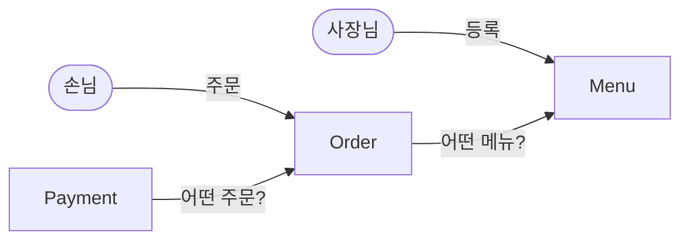
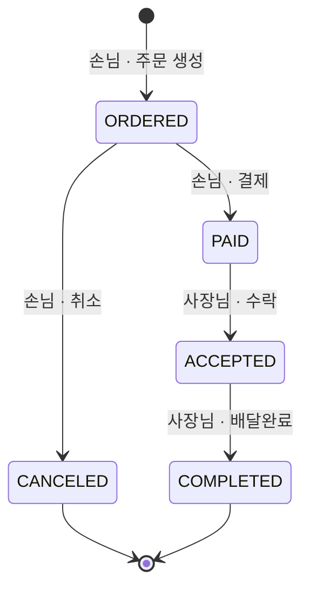
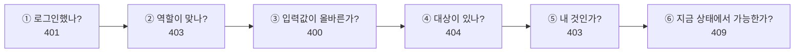

# 01. 요구사항 정의서

## 변경 이력

| 버전 | 날짜 | 변경 내용 | 관련 요구사항 |
|---|---|---|---|
| v1.0 | 2026-10-07 | 최초 작성 (필수 기능 12개, 도전 기능 5개, 권한 매트릭스, 검증 순서·상태 변경 API·JWT 정책 결정) | 발제 자료 PART 2 |
| v1.1 | 2026-10-07 | 모든 구현을 TDD로 진행하기로 하여 C-05(Service 단위 테스트)를 도전 기능에서 제외하고 비기능 요구사항(테스트)으로 이동 | [07 테스트 전략](07-test-strategy.md) |
| v1.5 | 2026-10-07 | 03 API 명세 결정 반영: 비밀번호 8~20자(F-01, 03 D-21), 메뉴 삭제 204·주문 상태 변경 200(03 D-19), 9장 갱신 | [03 API 명세서](03-api-spec.md) |
| v1.4 | 2026-10-07 | 메뉴 판매 상태(`ON_SALE`·`SOLD_OUT`) 추가: 등록 시 `ON_SALE`(F-03), 조회 시 상태 표시(F-04·F-05), 품절 메뉴 주문 409(F-08). 상태 변경 API는 범위 제외 | 개발자 추가 요구사항 |
| v1.3 | 2026-10-07 | 회원 상태(`ACTIVE`·`WITHDRAWN`) 추가: 탈퇴 회원 로그인 거절(F-02), 탈퇴 회원 아이디 재사용 불가(F-01). 탈퇴 API는 범위 제외 | 개발자 추가 요구사항 |
| v1.2 | 2026-10-07 | 발제 자료 대조 검증 반영: JWT 클레임에 회원 PK 추가(D-03), BCrypt 저장 형식 명시(F-01), 결제 응답에 주문 상태 포함(F-12, 시나리오 #24), 9·10장을 02 결정 결과로 갱신 | 발제 2-4, 5-1 |

 

## 1. 요구사항 요약 (근거)

- 근거 문서: 온보딩 과제 발제 자료(비공개, 레포 미포함) PART 2 (요구사항), 5-1 (테스트 시나리오). 이 문서의 기능 요구사항(6장)과 권한 매트릭스(7장)가 발제 요구사항을 옮겨 정리한 것입니다
- 이 문서는 **무엇을 만들지(범위)**와 **누가 무엇을 할 수 있는지(정책)**를 확정합니다.
- 테이블 구조와 API 모양은 각각 [02 도메인 설계](02-domain.md), [03 API 명세서](03-api-spec.md)에서 정합니다.

 

## 2. 쉬운 설명 (한눈에)

> 동네 가게의 **전화 주문을 앱으로 옮기는 서비스**입니다.
> 사장님은 메뉴판을 올리고, 손님은 메뉴를 골라 주문하고 카드로 결제합니다. 사장님은 들어온 주문을 받아서 배달까지 끝냅니다.
>
> 이 서비스가 지켜야 할 약속은 세 가지입니다.
> 1. **돈은 서버가 계산한다.** 손님이 "100원에 해 주세요"라고 보내도 믿지 않습니다.
> 2. **남의 것은 못 건드린다.** 남의 메뉴를 고치거나 남의 주문을 결제·취소할 수 없습니다.
> 3. **주문은 정해진 순서로만 진행된다.** 결제 전에 배달완료가 되거나, 결제한 주문을 손님이 혼자 취소할 수 없습니다.

 

## 3. 문제 정의

| 관점 | 해결해야 할 문제 |
|---|---|
| **사용자** | 손님은 메뉴를 보고 주문·결제·취소하고, 사장님은 들어온 주문을 순서대로 처리한다. 각자 **자기 것만** 보고 바꿀 수 있어야 한다. |
| **비즈니스** | 금액은 클라이언트를 믿을 수 없다. 결제가 끝난 주문은 손님이 일방적으로 취소할 수 없다. 메뉴를 내려도 **과거 주문 기록은 남아야** 한다. |
| **시스템** | 주문 상태는 정해진 경로로만 움직인다(상태 머신). 결제 기록 저장과 주문 상태 변경은 **함께 성공하거나 함께 실패**해야 한다. 요청자의 신원은 **토큰에서만** 신뢰한다. |

 

## 4. 개념 모델

### 4.1 액터

| 액터 | 설명 |
|---|---|
| 비로그인 사용자 | 가입, 로그인, 메뉴 조회만 가능 |
| 손님 `CUSTOMER` | 메뉴 조회, 주문 생성·취소, 결제, 내 주문 조회 |
| 사장님 `OWNER` | 메뉴 등록·수정·삭제, 내 메뉴에 들어온 주문 조회·수락·배달완료 |

외부 시스템은 없습니다. 결제사(PG)와 연동하지 않고 결제 기록만 저장합니다.

### 4.2 서비스 전제

- **가게 = 사장님 한 명.** 가게(Store)를 따로 두지 않습니다.
- **배달 라이더 없음.** 배달완료 처리까지 사장님이 합니다.
- **주문 1건 = 메뉴 1개 + 수량.**
- 결제 수단은 **카드만** 받습니다.

### 4.3 핵심 도메인과 책임

| 도메인 | 쉬운 설명 | 책임 |
|---|---|---|
| **User** | 가입한 사람 | 아이디·비밀번호·역할. 아이디는 중복 불가 |
| **Menu** | 사장님의 메뉴판 한 줄 | 이름·가격·설명. 주인(사장님)을 안다. 지워도 기록은 남는다(Soft Delete) |
| **Order** | 주문서 한 장 | 주문자·메뉴·수량·총액·배송 주소. **주문 상태 흐름의 주인** — 지금 결제·취소·수락·완료가 가능한지 스스로 판단한다 |
| **Payment** | 영수증 한 장 | 어떤 주문의 결제인지, 금액·수단·결제 상태. 한 주문에 여러 장 쌓일 수 있지만 **"결제 완료"는 한 번만** |

**읽는 법**
- 화살표는 "누가 누구를 가리키는가"입니다. Order는 Menu를, Payment는 Order를 가리킵니다. 반대 방향으로는 가리키지 않습니다.
- Payment가 Order를 가리키지만, **주문 상태를 바꿀지 판단하는 건 Order**입니다. Payment는 "결제했다"는 기록만 남깁니다.

 

## 5. 주문 상태 흐름

| 누가 | 허용되는 상태 변경 | 사용하는 기능 |
|---|---|---|
| 손님 `CUSTOMER` | `ORDERED → PAID` | F-12 결제 |
| 손님 `CUSTOMER` | `ORDERED → CANCELED` | F-10 주문 취소 |
| 사장님 `OWNER` | `PAID → ACCEPTED` | F-11 수락 |
| 사장님 `OWNER` | `ACCEPTED → COMPLETED` | F-11 배달완료 |

**읽는 법**
- 화살표가 없는 이동은 모두 **409로 거절**합니다. 예: 결제 전 수락, 결제 후 취소, 배달완료 후 다시 수락.
- 손님은 결제 전(`ORDERED`)에만 무언가를 할 수 있고, 사장님은 결제 후(`PAID`부터)에만 무언가를 할 수 있습니다.

> 상태 다이어그램의 상세(결제 상태, 동시 결제 방지 등)는 [02 도메인 설계](02-domain.md)에서 다룹니다.

 

## 6. 기능 요구사항

### 6.1 필수 기능 목록

| ID | 구분 | 기능 | 권한 | 성공 |
|---|---|---|---|---|
| F-01 | 회원 | 회원가입 | 누구나 | 201 |
| F-02 | 회원 | 로그인 | 누구나 | 200 |
| F-03 | 메뉴 | 메뉴 등록 | OWNER | 201 |
| F-04 | 메뉴 | 메뉴 목록 조회 | 누구나 | 200 |
| F-05 | 메뉴 | 메뉴 단건 조회 | 누구나 | 200 |
| F-06 | 메뉴 | 메뉴 수정 | OWNER · 본인 메뉴 | 200 |
| F-07 | 메뉴 | 메뉴 삭제 (Soft Delete) | OWNER · 본인 메뉴 | 204 |
| F-08 | 주문 | 주문 생성 | CUSTOMER | 201 |
| F-09 | 주문 | 주문 목록 조회 | 로그인 사용자 (역할별 목록) | 200 |
| F-10 | 주문 | 주문 취소 | CUSTOMER · 본인 주문 | 200 |
| F-11 | 주문 | 주문 상태 변경 (수락 · 배달완료) | OWNER · 본인 메뉴 주문 | 200 |
| F-12 | 결제 | 결제 | CUSTOMER · 본인 주문 | 201 |

> URL과 요청·응답 형식은 [03 API 명세서](03-api-spec.md)를 따릅니다. 상태 변경은 변경된 주문을 200으로 돌려주고, 삭제는 204입니다 (03 D-19).

### 6.2 기능별 상세

실패 조건은 [7.1 검증 순서](#71-검증-순서-d-01)대로 검사합니다. "401"은 [C-04](#63-도전-기능) 전까지는 Spring Security 기본 동작에 따라 403으로 응답합니다.

#### 👤 회원

**F-01 회원가입** · 누구나
- 입력: 아이디, 비밀번호, 역할(`CUSTOMER` 또는 `OWNER`)
- 규칙
  - 아이디 4~20자, 비밀번호 **8~20자** (상한은 BCrypt 72바이트 제한 때문 — [03 D-21](03-api-spec.md))
  - 비밀번호는 BCrypt로 해시해 저장하고, **응답에 담지 않는다**
  - 저장 값은 `$2a$`처럼 **`$2`로 시작하는 순수 BCrypt 해시**여야 한다 (발제 5-1 ⑥). `{bcrypt}` 같은 인코더 접두사를 붙이지 않는다
- 실패: 400 값 누락·조건 위반·역할 값 오류 · 409 이미 있는 아이디 (탈퇴한 회원의 아이디 포함)
- 가입한 회원의 상태는 `ACTIVE`

**F-02 로그인** · 누구나
- 입력: 아이디, 비밀번호
- 규칙
  - 성공하면 **응답 본문**에 JWT를 담아 준다 ([D-03](#73-jwt-정책-d-03))
  - 토큰에는 회원 PK·아이디·역할·만료 시간만 담는다. 비밀번호 등 민감정보는 담지 않는다 ([D-03](#73-jwt-정책-d-03))
- 실패: 400 값 누락 · 401 아이디 없음, 비밀번호 불일치, **탈퇴한 회원**(`WITHDRAWN`) (어느 경우인지 구분해 알려주지 않는다)

#### 🍜 메뉴

**F-03 메뉴 등록** · OWNER
- 입력: 이름, 가격, 설명(선택)
- 규칙
  - 메뉴 주인은 **토큰의 사용자**. 요청 본문으로 받지 않는다
  - 판매 상태는 `ON_SALE`으로 시작한다
- 실패: 401 · 403 CUSTOMER · 400 이름 없음, 가격 1원 미만

**F-04 메뉴 목록 조회** · 누구나
- 규칙
  - 로그인 없이 조회 가능
  - **삭제된 메뉴는 제외**
  - 모든 사장님의 메뉴를 함께 보여준다
  - 품절(`SOLD_OUT`) 메뉴도 목록에 보이며, 응답에 판매 상태를 담는다
  - C-03 적용 시 페이징·정렬

**F-05 메뉴 단건 조회** · 누구나
- 규칙: 응답에 판매 상태를 담는다
- 실패: 404 없거나 삭제된 메뉴

**F-06 메뉴 수정** · OWNER · 본인 메뉴
- 입력: 이름, 가격, 설명 (검증은 F-03과 같음)
- 규칙: 수정 시각이 자동으로 바뀐다 (JPA Auditing)
- 실패: 401 · 403 CUSTOMER · 400 값 오류 · 404 없거나 삭제된 메뉴 · 403 다른 사장님의 메뉴

**F-07 메뉴 삭제 (Soft Delete)** · OWNER · 본인 메뉴
- 규칙
  - 실제로 지우지 않고 "삭제됨"으로 표시한다
  - 삭제된 메뉴는 목록에서 빠지고, 단건 조회·수정·삭제·주문에서 **없는 메뉴(404)**로 처리한다
  - 이미 들어온 주문 기록은 그대로 남는다
- 실패: 401 · 403 CUSTOMER · 404 없거나 이미 삭제된 메뉴 · 403 다른 사장님의 메뉴

#### 🧾 주문

**F-08 주문 생성** · CUSTOMER
- 입력: 메뉴 ID, 수량, 배송 주소
- 규칙
  - **총액 = 메뉴 가격 × 수량**을 서버가 계산해 저장한다. 금액은 요청으로 받지 않는다
  - 주문자는 토큰의 사용자, 처음 상태는 `ORDERED`
- 실패: 401 · 403 OWNER · 400 수량 1 미만, 배송 주소 없음 · 404 없거나 삭제된 메뉴 · 409 품절(`SOLD_OUT`) 메뉴

**F-09 주문 목록 조회** · 로그인 사용자
- 규칙
  - CUSTOMER: **내가 한 주문만**
  - OWNER: **내 메뉴에 들어온 주문만**. 삭제된 메뉴의 주문도 포함한다
  - 모든 상태(취소 포함)의 주문을 상태와 함께 보여준다
  - 최신 주문순으로 정렬한다
  - Spring Data JPA Query Methods로 조회한다
- 실패: 401

**F-10 주문 취소** · CUSTOMER · 본인 주문
- 규칙: `ORDERED → CANCELED`
- 실패: 401 · 403 OWNER · 404 없는 주문 · 403 다른 손님의 주문 · 409 `ORDERED`가 아닌 주문

**F-11 주문 상태 변경** · OWNER · 본인 메뉴 주문
- 수락과 배달완료를 **별도 동작으로** 제공한다 ([D-02](#72-상태-변경-api-모양-d-02))
  - 수락: `PAID → ACCEPTED`
  - 배달완료: `ACCEPTED → COMPLETED`
- 실패: 401 · 403 CUSTOMER · 404 없는 주문 · 403 다른 사장님 메뉴의 주문 · 409 허용되지 않는 상태

#### 💳 결제

**F-12 결제** · CUSTOMER · 본인 주문
- 입력: 결제 수단
- 규칙
  - 결제 수단은 **카드만**
  - 결제 금액은 요청으로 받지 않고 **주문 총액을 그대로** 쓴다
  - 성공하면 결제 기록을 저장하고 주문 상태를 `PAID`로 바꾼다. 두 작업은 함께 성공하거나 함께 실패한다
  - 응답에는 **결제 금액**과 **변경된 주문 상태(`PAID`)**를 포함한다 (발제 5-1 #24에서 둘 다 확인)
- 실패: 401 · 403 OWNER · 400 카드가 아닌 결제 수단 · 404 없는 주문 · 403 다른 손님의 주문 · 409 `ORDERED`가 아닌 주문 (이미 결제됨, 취소됨 등)

### 6.3 도전 기능

필수 기능 12개를 모두 끝낸 뒤 진행합니다.

| ID | 기능 | 권한 | 설계 영향 |
|---|---|---|---|
| C-01 | 주문 단건 조회 | CUSTOMER 본인 주문 · OWNER 본인 메뉴 주문 | API 1개 추가 |
| C-02 | 결제 내역 조회 | CUSTOMER 본인 주문의 결제 기록 | API 1개 추가 |
| C-03 | 메뉴 목록 페이징·정렬 | 누구나 | F-04 응답이 배열에서 페이지 객체로 바뀜. 기본: 10개씩, 최신 등록순 |
| C-04 | 에러 응답 통일 + 401/403 구분 | — | Security에 인증 실패(401)·권한 없음(403) 처리기 추가 |

C-03은 F-04의 응답 형태를 바꾸므로, **03 API 명세서에서 처음부터 페이지 응답으로 설계**합니다.

이번 범위에서 **제외**: 주문 생성 후 5분 이내 취소, 결제 후 취소·주문 거절, 여러 메뉴 담기·가게 분리, **회원 탈퇴 API** (회원 상태 컬럼만 확장 대비로 둔다 — [02 D-16](02-domain.md)), **메뉴 판매 상태 변경 API** (상태 컬럼과 품절 주문 규칙만 둔다 — [02 D-17](02-domain.md))

 

## 7. 정책 결정

### 7.1 검증 순서 (D-01)

> **쉬운 설명:** 남의 택배 상자를 열려는 사람에게 "이미 뜯긴 상자예요"라고 알려주면 안 됩니다. **"당신 택배가 아니에요"를 먼저** 말해야 합니다.

한 요청이 여러 규칙을 동시에 어기면 아래 순서로 검사해 **먼저 걸린 것 하나**를 응답합니다.

| 단계 | 검사 | 응답 | 검사하는 곳 |
|---|---|---|---|
| ① | 토큰이 있고 유효한가 | 401 | Security 필터 |
| ② | 역할이 맞는가 (예: 주문 생성은 CUSTOMER) | 403 | Security URL 규칙 |
| ③ | 입력값이 형식에 맞는가 | 400 | presentation (`@Valid`, JSON 변환) |
| ④ | 대상(메뉴·주문)이 존재하는가 | 404 | 도메인 서비스 |
| ⑤ | 대상이 요청자의 것인가 | 403 | 도메인 서비스 → 엔티티 메서드 |
| ⑥ | 현재 상태에서 허용되는 동작인가 | 409 | 엔티티 메서드 |

**선택 이유**
- 남의 주문 상태(결제됐는지 등)를 노출하지 않습니다.
- 발제 시나리오와 일치합니다. 예: #23 `cust2`가 `cust1`의 주문 결제 → 403, #27 `owner2`가 주문 수락 → 403

**포기한 것:** 권한 실패도 404로 응답해 대상의 존재 자체를 숨기는 방식(실무에서 쓰기도 함). 발제 체크리스트가 403을 요구해 채택하지 않았습니다.

### 7.2 상태 변경 API 모양 (D-02)

> **쉬운 설명:** 다이얼 하나를 돌리는 대신 **버튼을 동작별로 따로** 만듭니다. 버튼마다 누를 수 있는 사람이 정해져 있습니다.

| 동작 | 누가 | 상태 변경 |
|---|---|---|
| 취소 | CUSTOMER | `ORDERED → CANCELED` |
| 수락 | OWNER | `PAID → ACCEPTED` |
| 배달완료 | OWNER | `ACCEPTED → COMPLETED` |
| 결제 | CUSTOMER | `ORDERED → PAID` (결제 API, 결제 기록 생성 포함) |

**선택 이유**
- 동작마다 역할이 하나로 정해져서, 권한 규칙(7.4)을 Security URL 규칙으로 그대로 옮길 수 있습니다.
- 엔티티 메서드(`order.cancel()`, `order.accept()`, `order.complete()`, `order.pay()`)와 1:1로 대응합니다.

**포기한 것:** 상태 값을 본문으로 받는 단일 API의 간결함. 그 방식은 "손님이 ACCEPTED로 바꾸려 함" 같은 검사를 서비스에서 분기해야 합니다.

URL은 [03 API 명세서](03-api-spec.md)에서 확정합니다.

### 7.3 JWT 정책 (D-03)

| 항목 | 결정 |
|---|---|
| 전달 위치 | 로그인 **응답 본문** |
| 만료 시간 | **1시간** |
| 담는 정보 | 회원 PK(`sub`), 아이디(`username`), 역할(`role`), 만료 시간(`exp`) |
| 요청 시 | `Authorization: Bearer {토큰}` 헤더 |
| 서명 | HS256, 비밀키는 환경 변수 `JWT_SECRET` (32바이트 이상) |
| Refresh Token | 사용하지 않음. 만료되면 다시 로그인 |

**선택 이유**
- Postman에서 꺼내 쓰기 쉽습니다.
- 1시간이면 테스트 시나리오를 한 번 진행하기에 충분하고, 토큰이 유출돼도 피해 시간이 짧습니다.
- **회원 PK를 함께 담는 이유:** 발제는 "아이디(로그인 아이디)와 역할, 만료 시간"을 요구하고 민감정보만 금지합니다. 도메인 서비스는 회원 PK로 소유 확인을 하므로(04 D-13), PK를 토큰에 담으면 필터가 **요청마다 DB를 조회하지 않고** 인증 정보를 만들 수 있습니다. PK는 민감정보가 아닙니다.

**포기한 것:** 발제 문구(아이디·역할·만료)와 정확히 같은 최소 클레임. 그 경우 요청마다 `username`으로 회원을 조회해야 합니다.

### 7.4 권한 매트릭스

✅ 허용 · ❌ 거절 · 🔒 본인 것만 (아니면 403)

| ID | 기능 | 비로그인 | CUSTOMER | OWNER |
|---|---|---|---|---|
| F-01 | 회원가입 | ✅ | ✅ | ✅ |
| F-02 | 로그인 | ✅ | ✅ | ✅ |
| F-03 | 메뉴 등록 | ❌ 401 | ❌ 403 | ✅ (주인 = 요청자) |
| F-04 | 메뉴 목록 조회 | ✅ | ✅ | ✅ |
| F-05 | 메뉴 단건 조회 | ✅ | ✅ | ✅ |
| F-06 | 메뉴 수정 | ❌ 401 | ❌ 403 | 🔒 본인 메뉴 |
| F-07 | 메뉴 삭제 | ❌ 401 | ❌ 403 | 🔒 본인 메뉴 |
| F-08 | 주문 생성 | ❌ 401 | ✅ (주문자 = 요청자) | ❌ 403 |
| F-09 | 주문 목록 조회 | ❌ 401 | 🔒 내가 한 주문 | 🔒 내 메뉴의 주문 |
| F-10 | 주문 취소 | ❌ 401 | 🔒 본인 주문 | ❌ 403 |
| F-11 | 주문 수락 | ❌ 401 | ❌ 403 | 🔒 본인 메뉴의 주문 |
| F-11 | 주문 배달완료 | ❌ 401 | ❌ 403 | 🔒 본인 메뉴의 주문 |
| F-12 | 결제 | ❌ 401 | 🔒 본인 주문 | ❌ 403 |
| C-01 | 주문 단건 조회 | ❌ 401 | 🔒 본인 주문 | 🔒 본인 메뉴의 주문 |
| C-02 | 결제 내역 조회 | ❌ 401 | 🔒 본인 주문 | ❌ 403 |

**읽는 법**
- ❌는 **역할만 보고** 거절할 수 있어서 Security URL 규칙에서 막습니다 (7.1의 ②).
- 🔒는 대상을 DB에서 조회해야 알 수 있어서 도메인 서비스에서 검사합니다 (7.1의 ⑤, 04 D-11).
- F-09와 C-01은 두 역할 모두 허용되지만 **보이는 범위가 다릅니다.** URL 규칙은 "로그인만" 검사하고, 범위는 서비스에서 나눕니다.

 

## 8. 비기능 요구사항

과제 공통 요구사항(발제 2-5) 중 설계에 영향을 주는 것입니다.

| 항목 | 요구사항 |
|---|---|
| 아키텍처 | 4계층 레이어드 (presentation · application · domain · infrastructure) |
| 데이터 | 모든 테이블에 생성·수정 시각 자동 기록, enum은 문자열로 저장, 필수 값 NOT NULL, 아이디 UNIQUE를 **DB 제약으로도** 건다 |
| 보안 | 비밀번호 BCrypt, 응답에 Entity 직접 노출 금지(DTO), 비밀값은 환경 변수 |
| 일관성 | 결제 기록 저장과 주문 상태 변경은 한 트랜잭션 |
| 테스트 | 모든 구현은 **TDD**로 진행한다. 도메인(엔티티·도메인 서비스)·Facade 단위 테스트, Repository 테스트, API E2E 테스트로 성공·실패 케이스를 모두 검증한다 ([07 테스트 전략](07-test-strategy.md)) |
| 상태 코드 | 상태 흐름 규칙 위반은 **409**로 통일 |

 

## 9. 이후 문서에서 결정한 항목

| 항목 | 결정 | 문서 |
|---|---|---|
| Soft Delete 표현 | `deleted_at` 시각 (D-05) | [02](02-domain.md) |
| 주문에 메뉴 스냅샷 저장 | 복사한다 — `menu_name`, `unit_price` (D-06) | [02](02-domain.md) |
| "결제 완료 1회" 보장 방법 | 주문 상태 검사 + 낙관적 락 (D-04) | [02](02-domain.md) |
| 금액 타입과 수량 상한 | `Long`(BIGINT), 수량 상한 없음 (D-09) | [02](02-domain.md) |
| 로그인 아이디 필드 이름 | `username` (D-07) | [02](02-domain.md) |
| URL, 결제 API 경로, 200/204 선택, 목록 응답 필드 | 인증 `/api/auth/**`, 결제 `/api/orders/{id}/payments`, 상태 변경 200·삭제 204, 주문 응답에 주문자 아이디 (D-18~D-25) | [03](03-api-spec.md) |

 

## 10. 잠재 리스크

| 리스크 | 상황 | 대응 (02에서 결정) |
|---|---|---|
| **동시 결제** | 같은 주문에 결제 요청 두 건이 거의 동시에 오면 둘 다 `ORDERED`를 보고 통과할 수 있다 | **낙관적 락**(`orders.version`)으로 결정. 충돌 시 409 (D-04) |
| **동시 가입** | 같은 아이디로 가입 요청 두 건이 동시에 오면 서비스의 중복 검사를 둘 다 통과할 수 있다 | DB `UNIQUE` 제약 + 위반 예외를 409(`DUPLICATE_USERNAME`)로 변환 (04 6장) |
| **금액 overflow** | `가격 × 수량`이 `int` 범위(약 21억)를 넘을 수 있다 | 금액을 `Long`으로 결정 (D-09). 수량 상한은 두지 않음 |
| **메뉴 가격 변경** | 주문 후 메뉴 가격이 바뀌면 주문 내역에 보이는 메뉴 정보가 달라질 수 있다 | 총액 저장 + 메뉴 이름·단가 스냅샷으로 결정 (D-06) |
