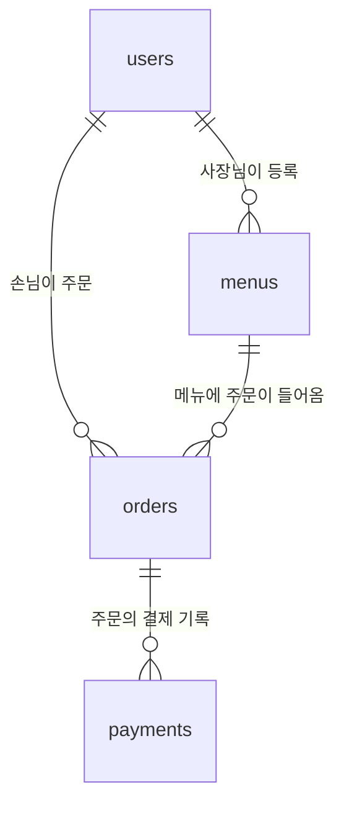
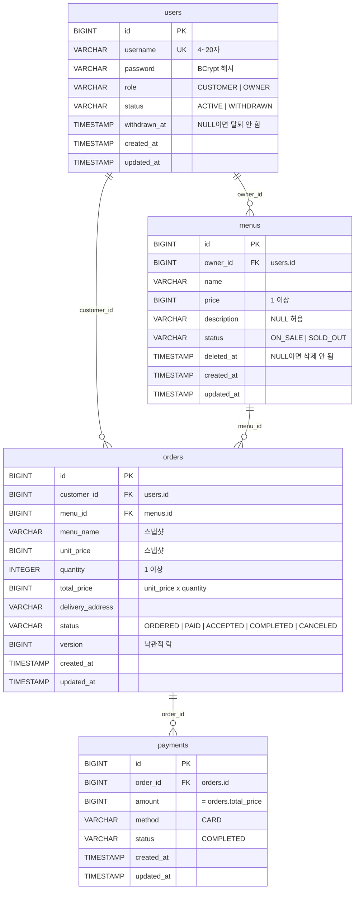

# 02. 도메인 설계 (ERD · 테이블 명세서)

## 변경 이력

| 버전 | 날짜 | 변경 내용 | 관련 요구사항 |
|---|---|---|---|
| v1.0 | 2026-10-07 | 최초 작성 (ERD, 테이블 명세서, 결제 동시성·Soft Delete·스냅샷 결정) | 01 요구사항 정의서 v1.1 |
| v1.1 | 2026-10-07 | 비밀번호 저장 형식을 순수 BCrypt 해시(`$2`로 시작)로 명시, `password` 컬럼 길이 60으로 확정 (D-14) | 발제 5-1 ⑥ |
| v1.3 | 2026-10-07 | `menus`에 판매 상태(`status`: `ON_SALE`·`SOLD_OUT`) 추가. 상태 변경 API는 만들지 않고 확장 대비용, 품절 메뉴 주문은 409 (D-17) | 01 v1.4 (메뉴 상태) |
| v1.2 | 2026-10-07 | `users`에 회원 상태(`status`)와 탈퇴 시각(`withdrawn_at`) 추가. 탈퇴 기능은 만들지 않고 확장 대비용 (D-16) | 01 v1.3 (회원 상태) |

<br>

## 1. 요구사항 요약 (근거)

- [01 요구사항 정의서](01-requirements.md) 4장(개념 모델), 5장(주문 상태 흐름), 6장(기능 요구사항), 8장(비기능 요구사항), 10장(잠재 리스크)
- 발제 자료 2-2(꼭 저장해야 하는 정보와 연관관계), 2-5(공통 요구사항), 3-5(막히기 쉬운 지점)

<br>

## 2. 쉬운 설명 (한눈에)

> 테이블은 4개입니다. **회원 · 메뉴 · 주문 · 결제.**
>
> - 메뉴에는 "누구의 메뉴인지", 주문에는 "누가 · 어떤 메뉴를", 결제에는 "어떤 주문의 결제인지"가 적혀 있습니다.
> - **주문은 영수증처럼** 주문 당시의 메뉴 이름과 단가를 직접 적어 둡니다. 메뉴판이 바뀌어도 주문 내역은 그대로입니다.
> - 메뉴를 지우면 **"지워짐" 도장과 날짜**만 찍고 실제로 지우지 않습니다. 과거 주문이 그 메뉴를 가리키고 있기 때문입니다.
> - 주문서에는 **버전 번호**가 있어서, 두 사람이 동시에 같은 주문서를 고치면 나중 사람이 실패합니다. 이중 결제를 막습니다.

<br>

## 3. 설계 결정

| ID | 결정점 | 선택 | 이유 | 포기한 것 |
|---|---|---|---|---|
| D-04 | 결제 1회 보장 · 동시 요청 | **낙관적 락** (`orders.version`) + 주문 상태 검사 | 같은 주문에 동시 요청이 몰리는 일은 드물다. 결제·취소·수락이 모두 주문 상태 하나를 바꾸므로, 주문에 버전을 두면 모든 상태 변경이 한 번에 보호된다 | 비관적 락의 "기다렸다가 기존 409 로직에 걸리는" 단순한 흐름. 충돌 예외(`ObjectOptimisticLockingFailureException`)를 409로 변환하는 처리가 추가로 필요 |
| D-05 | Soft Delete 표현 | **`deleted_at`** (NULL이면 삭제 안 됨) | 컬럼 하나로 삭제 여부와 시점을 모두 남긴다 | boolean의 직관성 |
| D-06 | 주문 스냅샷 | **복사한다** (`menu_name`, `unit_price`) | 메뉴가 수정·삭제돼도 주문 내역은 주문 당시 그대로 보인다. 주문 목록에서 메뉴 이름을 보여줄 때 `menus`를 조회하지 않아도 된다 | 정규화. 이름·가격이 두 테이블에 저장됨 |
| D-07 | 로그인 아이디 필드 | **`username`** | Spring Security의 `UserDetails` 용어와 같다 | — |
| D-08 | 테이블 이름 | **복수형** (`users`, `menus`, `orders`, `payments`) | PostgreSQL 예약어(`user`, `order`)를 피하면서 접두사보다 읽기 쉽다 | — |
| D-09 | 금액 타입 | **`BIGINT` (Java `Long`)**, 원 단위 정수 | `가격 × 수량`의 `int` overflow를 막는다. 원화라 소수점이 필요 없다 | `BigDecimal`의 정밀도 (불필요) |
| D-17 | 메뉴 판매 상태 | **`status`(`ON_SALE`·`SOLD_OUT`)**, `deleted_at`과 **별도 컬럼**. 이번 범위에서는 **컬럼만** 두고 상태 변경 API는 만들지 않는다. 품절 메뉴 주문 규칙(409)은 도메인에 둔다 | 재고 수량은 주문마다 차감해야 해서 동시성 문제가 생긴다. 상태값은 가볍다. `status`는 "지금 파나"(되돌릴 수 있음), `deleted_at`은 "메뉴판에 존재하나"(되돌리지 않음)로 의미가 다르다 | 재고 수량 관리, `HIDDEN`(숨김) 상태, 상태와 삭제를 한 컬럼으로 합치는 단순함 |
| D-16 | 회원 상태 | **`status`(`ACTIVE`·`WITHDRAWN`) + `withdrawn_at`**. 이번 범위에서는 **컬럼만** 두고 탈퇴 API는 만들지 않는다. 탈퇴 회원의 아이디는 재사용 불가 | 나중에 탈퇴·정지 기능을 추가할 때 테이블 구조를 바꾸지 않아도 된다. 상태와 시점을 모두 남긴다. 아이디 재사용을 막아 기존 UNIQUE 제약을 그대로 쓴다 | `deleted_at` 하나로 메뉴와 방식을 맞추는 단순함. 탈퇴 아이디 재사용(부분 UNIQUE 인덱스와 별도 SQL 필요) |
| D-14 | 비밀번호 저장 형식 | **`BCryptPasswordEncoder`를 직접 사용**, 순수 BCrypt 해시(`$2a$...`, 60자) 저장 | 발제 5-1 ⑥이 "`$2`로 시작하는 BCrypt 값"을 확인한다. Spring 기본 위임 인코더는 `{bcrypt}$2a$...`처럼 접두사를 붙여 이 확인을 통과하지 못한다 | 위임 인코더의 알고리즘 교체 유연성 |

### 3.1 낙관적 락이 이중 결제를 막는 방식 (D-04 상세)

결제 기록 저장과 주문 상태 변경은 **한 트랜잭션**입니다. 두 요청이 동시에 같은 주문을 결제하면,

```
요청 A: 주문 조회 (version 0) → order.pay() → 결제 INSERT → 주문 UPDATE ... WHERE version = 0 ✅ (version 1) → 커밋
요청 B: 주문 조회 (version 0) → order.pay() → 결제 INSERT → 주문 UPDATE ... WHERE version = 0 ❌ 0건 수정
        → ObjectOptimisticLockingFailureException → 트랜잭션 전체 롤백 (B의 결제 기록도 사라짐) → 409
```

- B의 결제 기록은 같은 트랜잭션이라 함께 롤백됩니다. **결제 완료 기록은 항상 1건**입니다.
- 순차적인 재결제(이미 `PAID`인 주문을 다시 결제)는 락이 아니라 `order.pay()`의 상태 검사에서 409로 막힙니다.

<br>

## 4. ERD

### 4.1 한눈에 보기



**읽는 법**
- 4개 관계가 모두 **1:N**이고, **N 쪽이 외래키를 가집니다.** 메뉴가 `owner_id`, 주문이 `customer_id`·`menu_id`, 결제가 `order_id`를 가집니다.
- `users`와 연결된 관계가 두 개지만 의미가 다릅니다. 메뉴 쪽은 **사장님**, 주문 쪽은 **손님**입니다. 역할 검사는 DB가 아니라 애플리케이션이 합니다.

### 4.2 상세



**읽는 법**
- `orders`에는 `menu_id`(어떤 메뉴인지)와 `menu_name`·`unit_price`(주문 당시 값)가 **함께** 있습니다. 메뉴를 찾아갈 때는 `menu_id`, 화면에 보여줄 때는 스냅샷을 씁니다.
- `payments`가 주문당 여러 건일 수 있는 구조지만, 지금 범위에서 결제 상태는 `COMPLETED` 하나라 **실제로는 주문당 최대 1건**입니다. 결제 취소가 추가되면 `CANCELED` 기록이 쌓이는 구조로 확장됩니다.
- 사장님의 주문 목록은 `orders` → `menus.owner_id`를 따라가 조회합니다. `orders`에 사장님 ID를 따로 두지 않습니다.

<br>

## 5. 테이블 명세서

공통: 모든 테이블의 `id`는 `BIGINT` 자동 증가(`GenerationType.IDENTITY`), `created_at`·`updated_at`은 `TIMESTAMP NOT NULL`로 JPA Auditing이 채웁니다(`BaseEntity`). 아래 표에서는 생략합니다.

### 5.1 `users` — 회원

| 컬럼 | 타입 | 제약 | 설명 |
|---|---|---|---|
| `username` | VARCHAR(20) | NOT NULL, **UNIQUE** | 로그인 아이디 (4~20자) |
| `password` | VARCHAR(60) | NOT NULL | 순수 BCrypt 해시 (`$2a$`로 시작, 60자). 평문 저장 금지 |
| `role` | VARCHAR(20) | NOT NULL | `CUSTOMER`, `OWNER` (문자열 enum) |
| `status` | VARCHAR(20) | NOT NULL | `ACTIVE`, `WITHDRAWN` (문자열 enum). 가입 시 `ACTIVE` |
| `withdrawn_at` | TIMESTAMP | NULL 허용 | 탈퇴 시각. `status`가 `WITHDRAWN`일 때만 값이 있음 |

- `password`에는 `{bcrypt}` 같은 인코더 접두사를 붙이지 않습니다 (D-14). `PasswordEncoder` 빈은 `BCryptPasswordEncoder`로 등록합니다.
- 서비스의 중복 검사와 별개로 **DB UNIQUE 제약**을 겁니다. 동시 가입 시 서비스 검사를 둘 다 통과해도 DB가 막습니다.

- `status`와 `withdrawn_at`은 **함께** 바뀌어야 합니다. 엔티티에서 두 값을 한 메서드로만 바꾸도록 해서 어긋나지 않게 합니다 (탈퇴 기능 추가 시).
- 탈퇴 회원의 아이디도 UNIQUE 제약에 포함됩니다. 같은 아이디로 재가입하면 409입니다.

### 5.2 `menus` — 메뉴

| 컬럼 | 타입 | 제약 | 설명 |
|---|---|---|---|
| `owner_id` | BIGINT | NOT NULL, FK → `users(id)` | 메뉴 주인 (사장님) |
| `name` | VARCHAR(100) | NOT NULL | 메뉴 이름 |
| `price` | BIGINT | NOT NULL | 가격 (1원 이상, 애플리케이션 검증) |
| `description` | VARCHAR(500) | NULL 허용 | 설명 (선택) |
| `status` | VARCHAR(20) | NOT NULL | 판매 상태 `ON_SALE`, `SOLD_OUT` (문자열 enum). 등록 시 `ON_SALE` |
| `deleted_at` | TIMESTAMP | NULL 허용 | 삭제 시각. NULL이면 삭제되지 않은 메뉴 |

- `status`와 `deleted_at`은 독립입니다. 품절 메뉴도 목록·단건 조회에 **보이고**(상태 표시), 삭제된 메뉴만 빠집니다.
- 품절 메뉴로 주문하면 409입니다. 삭제 여부(404)를 먼저 확인한 뒤 판매 상태를 확인합니다.

### 5.3 `orders` — 주문

| 컬럼 | 타입 | 제약 | 설명 |
|---|---|---|---|
| `customer_id` | BIGINT | NOT NULL, FK → `users(id)` | 주문자 (손님) |
| `menu_id` | BIGINT | NOT NULL, FK → `menus(id)` | 주문한 메뉴 |
| `menu_name` | VARCHAR(100) | NOT NULL | 주문 당시 메뉴 이름 (스냅샷) |
| `unit_price` | BIGINT | NOT NULL | 주문 당시 메뉴 가격 (스냅샷) |
| `quantity` | INTEGER | NOT NULL | 수량 (1 이상, 애플리케이션 검증) |
| `total_price` | BIGINT | NOT NULL | 총액 = `unit_price × quantity`. 서버가 계산 |
| `delivery_address` | VARCHAR(255) | NOT NULL | 배송 주소 |
| `status` | VARCHAR(20) | NOT NULL | `ORDERED`, `PAID`, `ACCEPTED`, `COMPLETED`, `CANCELED` |
| `version` | BIGINT | NOT NULL | 낙관적 락 버전 (`@Version`) |

### 5.4 `payments` — 결제

| 컬럼 | 타입 | 제약 | 설명 |
|---|---|---|---|
| `order_id` | BIGINT | NOT NULL, FK → `orders(id)` | 결제한 주문 |
| `amount` | BIGINT | NOT NULL | 결제 금액 = 주문 총액. 요청으로 받지 않음 |
| `method` | VARCHAR(20) | NOT NULL | `CARD` |
| `status` | VARCHAR(20) | NOT NULL | `COMPLETED` |

### 5.5 매핑 규칙

| 규칙 | 적용 |
|---|---|
| 연관관계 | 4개 FK 모두 `@ManyToOne(fetch = FetchType.LAZY)` + `@JoinColumn(nullable = false)` |
| enum | 모두 `@Enumerated(EnumType.STRING)`. Hibernate가 허용 값 CHECK 제약을 함께 만든다 |
| 테이블 이름 | `@Table(name = "users")` 처럼 명시 |
| 길이 | `VARCHAR` 길이와 요청 DTO의 `@Size`를 일치시킨다 (03에서 확정) |

<br>

## 6. 주문 상태와 저장 구조

상태 흐름은 [01 요구사항 정의서 5장](01-requirements.md#5-주문-상태-흐름)을 따릅니다. 저장 구조와 관련된 규칙만 정리합니다.

| 동작 | `orders` 변화 | `payments` 변화 |
|---|---|---|
| 주문 생성 | INSERT (`ORDERED`, 스냅샷·총액 저장, `version` 0) | — |
| 결제 | `status` → `PAID`, `version` +1 | INSERT (`COMPLETED`, `amount` = `total_price`) |
| 취소 | `status` → `CANCELED`, `version` +1 | — |
| 수락 · 배달완료 | `status` → `ACCEPTED` · `COMPLETED`, `version` +1 | — |
| 메뉴 삭제 | 변화 없음 (주문 기록 유지) | — |

<br>

## 7. 잠재 리스크

| 리스크 | 상황 | 대응 선택지 |
|---|---|---|
| 낙관적 락 예외가 500으로 응답 | `ObjectOptimisticLockingFailureException`이 `GlobalExceptionHandler`의 `Exception` 핸들러에 잡힘 | **필수:** 전용 핸들러를 추가해 409로 변환 (`feat/order`에서 TDD로) |
| enum 값 추가 시 CHECK 제약 | 결제 취소(`CANCELED`) 등을 추가하면 `ddl-auto: update`가 기존 CHECK 제약을 갱신하지 않아 저장 실패 | 개발 중에는 `docker compose down -v`로 DB 초기화. 테스트는 Testcontainers라 영향 없음 |
| 문자열 길이 초과 | DTO 검증 없이 컬럼 길이를 넘는 값이 들어오면 DB 오류(500) | 03에서 모든 문자열 필드에 `@Size`를 컬럼 길이와 맞춰 정의 |
| 수량 상한 없음 | 매우 큰 수량은 `long`으로도 이론상 overflow 가능, 비현실적 주문 허용 | 현재는 허용 (요구사항 없음). 필요해지면 01에 상한을 추가하고 `@Max` 적용 |
| 스냅샷 불일치 | 메뉴 수정 후 주문 내역과 메뉴 정보가 다름 | **의도된 동작** (D-06). 주문 내역은 주문 당시 기준 |
| 탈퇴 회원의 기존 토큰 | 탈퇴 기능이 생기면, 필터가 DB를 조회하지 않으므로(04 D-15) 탈퇴 후에도 토큰 만료(최대 1시간)까지 요청이 통과함 | 현재는 탈퇴 API가 없어 영향 없음. 탈퇴 기능 추가 시 ① 만료까지 허용 ② 필터에서 회원 상태 조회 중 재결정 |
| `UserStatus` 값 추가 | `SUSPENDED` 등을 추가하면 CHECK 제약이 갱신되지 않음 (발제 3-5 ⑤) | 개발 DB는 `docker compose down -v`로 초기화 |
| 사장님 주문 목록 조회 비용 | `orders` → `menus` 조인으로 조회 | 과제 규모에서는 문제없음. 커지면 인덱스(`menus.owner_id`, `orders.menu_id`) 추가 |
