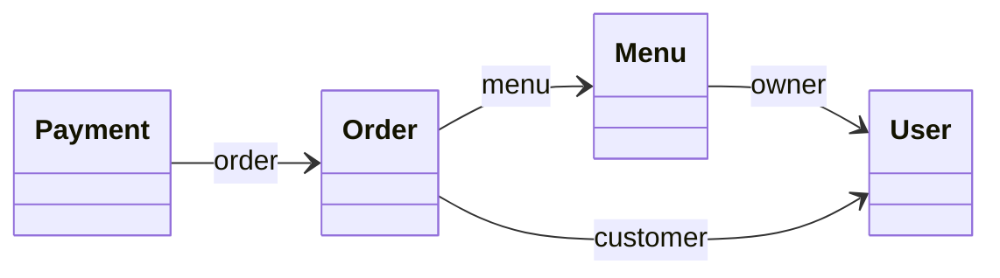
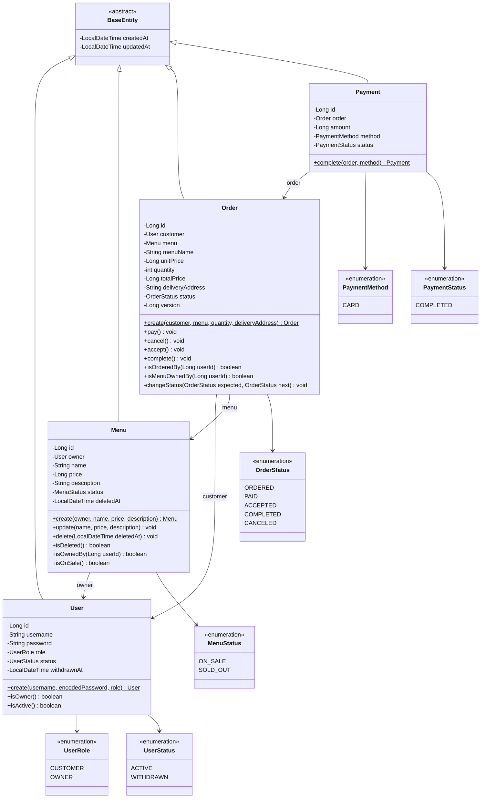
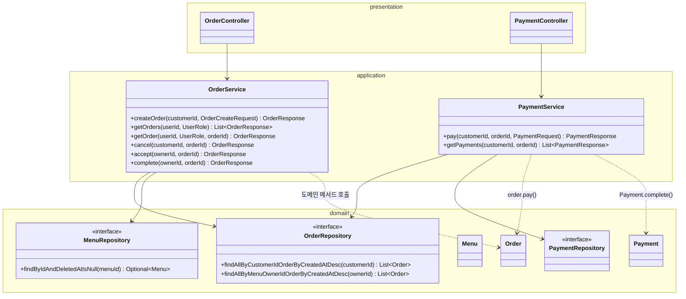

# 04. 클래스 다이어그램

## 변경 이력

| 버전 | 날짜 | 변경 내용 | 관련 요구사항 |
|---|---|---|---|
| v1.0 | 2026-10-07 | 최초 작성 (도메인 모델, 4계층 구조, 결제 책임 분리, 에러 코드) | 01 요구사항 정의서 v1.1, 02 도메인 설계 v1.0 |
| v1.4 | 2026-10-07 | 03 API 명세에 맞춰 DTO 이름 확정, 주문 상태 변경 메서드가 `OrderResponse` 반환, 주문 목록 조회에 `@EntityGraph`(주문자) 적용, C-01·C-02 Service 메서드 추가 | 03 v1.0 |
| v1.3 | 2026-10-07 | `Menu`에 `status`·`isOnSale()`, `MenuStatus` enum 추가. `Order.create()`가 품절 메뉴를 409(`MENU_SOLD_OUT`)로 거절 | 02 v1.3 D-17, 01 v1.4 |
| v1.2 | 2026-10-07 | `User`에 `status`·`withdrawnAt`, `UserStatus` enum, `isActive()` 추가 (로그인 시 활성 회원만 허용) | 02 v1.2 D-16, 01 v1.3 |
| v1.1 | 2026-10-07 | `AuthUser`를 JWT 클레임에서 DB 조회 없이 생성(D-15), `PasswordEncoder`는 `BCryptPasswordEncoder`, 동시 가입 시 UNIQUE 위반을 409로 변환 | 01 v1.2 D-03, 02 v1.1 D-14 |

 

## 1. 요구사항 요약 (근거)

- [01 요구사항 정의서](01-requirements.md): 주문 상태 흐름(5장), 검증 순서 D-01(7.1), 상태 변경 API D-02(7.2)
- [02 도메인 설계](02-domain.md): 테이블 구조, 낙관적 락 D-04, Soft Delete D-05, 스냅샷 D-06
- [07 테스트 전략](07-test-strategy.md): 계층별 테스트 방식, 결정성 원칙(시각 고정)
- `CLAUDE.md`: 4계층 구성과 의존 방향, "비즈니스 규칙은 엔티티에"

> DTO 이름과 Service 반환 타입은 [03 API 명세서](03-api-spec.md) 7장과 맞춰져 있습니다.

 

## 2. 쉬운 설명 (한눈에)

> 식당으로 비유하면,
> - **엔티티(domain)는 주문서·메뉴판·영수증**입니다. "결제 전 주문서는 수락할 수 없다" 같은 **규칙은 주문서 스스로** 지킵니다.
> - **Service(application)는 카운터 직원**입니다. 서류를 찾아오고(조회), 주문서에 일을 시키고(도메인 메서드 호출), 보관합니다(저장). 규칙을 직접 판단하지 않습니다.
> - **Controller(presentation)는 주문 창구**입니다. 손님의 요청서(DTO)를 받아 형식을 확인하고 직원에게 넘깁니다.
> - 결제할 때 직원은 **주문서에 "결제 완료"를 시키고 → 영수증을 만듭니다.** 주문서는 영수증의 존재를 모릅니다.

 

## 3. 설계 결정

| ID | 결정점 | 선택 | 이유 | 포기한 것 |
|---|---|---|---|---|
| D-10 | 결제 시 책임 분배 | **Service가 순서대로 지시**: `order.pay()` → `Payment.complete(order, method)` | 상태 판단은 Order, 기록은 Payment로 책임이 분리되고 각각 따로 테스트할 수 있다. 의존 방향 payment → order 유지 | Service 코드의 간결함 |
| D-11 | 규칙 위반 예외를 던지는 곳 | **상태 규칙(409)은 엔티티가 던지고, 소유 확인(403)·존재 확인(404)은 Service가 던진다** | 상태 규칙은 엔티티만으로 판단 가능. 소유 확인은 "누가 요청했는가"라는 유스케이스 맥락이고, 존재 확인은 조회 결과라 Service의 일이다. 엔티티는 `isOwnedBy()`로 판단 근거만 제공 | 엔티티가 모든 검증을 맡는 일관성 |
| D-12 | 현재 시각이 필요한 도메인 메서드 | **시각을 인자로 받는다** (`menu.delete(LocalDateTime)`). Service는 주입받은 `Clock`으로 시각을 만든다 | 테스트 결정성 원칙(07). 엔티티 테스트에서 시각을 고정할 수 있다 | `LocalDateTime.now()`를 엔티티 안에서 직접 호출하는 간결함 |
| D-13 | Service에 넘기는 사용자 정보 | **`userId`와 `UserRole`** (domain 타입만) | application이 Security의 인증 객체(`AuthUser`)에 묶이지 않는다. Controller가 `AuthUser`에서 꺼내 넘긴다 | `AuthUser`를 그대로 넘기는 간결함 |
| D-15 | 인증 정보 생성 | `JwtAuthenticationFilter`가 토큰 클레임(`sub`=회원 PK, `username`, `role`)으로 **DB 조회 없이** `AuthUser`를 만든다 | 01 D-03에서 토큰에 회원 PK를 담기로 함. 요청마다 회원 조회 쿼리가 나가지 않는다 | 탈퇴·역할 변경이 토큰 만료(1시간) 전까지 반영되지 않음 — 이번 범위에 탈퇴·역할 변경 기능이 없어 영향 없음 |

 

## 4. 도메인 모델

### 4.1 한눈에 보기

**읽는 법**
- 화살표는 **참조 방향**입니다. 모두 N 쪽에서 1 쪽을 가리키는 단방향 `@ManyToOne`이며, 반대 방향 컬렉션(`@OneToMany`)은 두지 않습니다.
- 그래서 `Order`는 `Payment`를 모르고, `User`는 자신의 메뉴·주문 목록을 갖지 않습니다. 목록이 필요하면 Repository로 조회합니다.

### 4.2 상세

**읽는 법**
- `$`가 붙은 메서드는 **정적 팩토리**입니다. 생성자 대신 이름 있는 메서드로 만들고, 생성 규칙(총액 계산, 스냅샷 복사, 초기 상태)을 그 안에 둡니다. JPA용 기본 생성자는 `protected`로 막습니다.
- `Order`의 상태 변경 메서드 4개는 모두 내부의 `changeStatus(expected, next)`를 거칩니다. 현재 상태가 `expected`가 아니면 `BusinessException(INVALID_ORDER_STATUS)` (409)를 던집니다.
- `Payment.complete(order, method)`는 금액을 **`order.getTotalPrice()`에서 가져옵니다.** 금액을 인자로 받지 않아서, 요청 금액이 끼어들 여지가 없습니다.

### 4.3 엔티티 메서드 명세

| 엔티티 | 메서드 | 규칙 | 실패 |
|---|---|---|---|
| `User` | `create(username, encodedPassword, role)` | 이미 해시된 비밀번호를 받는다 (암호화는 Service가 `PasswordEncoder`로). 상태는 `ACTIVE` | — |
| | `isActive()` | `status == ACTIVE`. 로그인 시 `UserService`가 확인해 아니면 401(`INVALID_CREDENTIALS`) | — |
| `Menu` | `create(owner, name, price, description)` | 주인은 인자로 받은 사용자 | — |
| | `update(name, price, description)` | 세 값을 모두 교체 | — |
| | `delete(deletedAt)` | `deletedAt` 기록 | — |
| | `isOwnedBy(userId)` | `owner.id == userId` | — |
| | `isOnSale()` | `status == ON_SALE` | — |
| `Order` | `create(customer, menu, quantity, deliveryAddress)` | 메뉴가 판매 중(`isOnSale()`)이어야 한다. `menuName`·`unitPrice`를 메뉴에서 복사, `totalPrice = unitPrice × quantity`, 상태 `ORDERED` | 409 `MENU_SOLD_OUT` |
| | `pay()` | `ORDERED → PAID` | 409 |
| | `cancel()` | `ORDERED → CANCELED` | 409 |
| | `accept()` | `PAID → ACCEPTED` | 409 |
| | `complete()` | `ACCEPTED → COMPLETED` | 409 |
| | `isOrderedBy(userId)` | `customer.id == userId` | — |
| | `isMenuOwnedBy(userId)` | `menu.isOwnedBy(userId)` | — |
| `Payment` | `complete(order, method)` | `amount = order.totalPrice`, 상태 `COMPLETED` | — |

- 입력값 형식(가격 1 이상, 수량 1 이상 등)은 presentation의 `@Valid`가 검증합니다 (01의 검증 순서 ③). 엔티티는 형식 검증을 중복하지 않습니다.

 

## 5. 계층 구조

### 5.1 대표: 주문·결제 도메인

`order`와 `payment`를 대표로 그립니다. `user`, `menu`도 같은 모양입니다.

**읽는 법**
- 의존은 **presentation → application → domain** 한 방향입니다. Controller는 Repository를 모릅니다.
- `PaymentService`는 다른 도메인의 `OrderRepository`를 직접 씁니다. 도메인 간 의존은 **payment → order → menu → user** 방향만 허용하고, 반대 방향(order가 payment를 아는 것)은 만들지 않습니다.
- Service 메서드는 `userId`·`UserRole`만 받습니다(D-13). Controller가 `@AuthenticationPrincipal AuthUser`에서 꺼내 넘깁니다.

### 5.2 패키지별 클래스 목록

| 패키지 | presentation | application | domain | infrastructure |
|---|---|---|---|---|
| `global` | `GlobalExceptionHandler`, `ErrorResponse` | — | `BaseEntity`, `BusinessException`, `ErrorCode` | `SecurityConfig`, `JpaAuditingConfig`, `ClockConfig`, `JwtProvider`, `JwtAuthenticationFilter`, `AuthUser` |
| `user` | `UserController`, `SignupRequest`, `LoginRequest`, `UserResponse`, `LoginResponse` | `UserService` | `User`, `UserRole`, `UserStatus`, `UserRepository` | — |
| `menu` | `MenuController`, `MenuRequest`, `MenuResponse` | `MenuService` | `Menu`, `MenuStatus`, `MenuRepository` | — |
| `order` | `OrderController`, `OrderCreateRequest`, `OrderResponse` | `OrderService` | `Order`, `OrderStatus`, `OrderRepository` | — |
| `payment` | `PaymentController`, `PaymentRequest`, `PaymentResponse` | `PaymentService` | `Payment`, `PaymentMethod`, `PaymentStatus`, `PaymentRepository` | — |

- `UserService`는 `PasswordEncoder`와 `JwtProvider`(infrastructure)를 사용합니다. application → infrastructure 의존은 허용하고, domain → infrastructure 의존만 금지합니다.
- `PasswordEncoder` 빈은 `SecurityConfig`에서 **`BCryptPasswordEncoder`**로 등록합니다. 기본 위임 인코더는 `{bcrypt}` 접두사를 붙여 발제 5-1 ⑥ 확인을 통과하지 못합니다 (02 D-14).
- `AuthUser(userId, username, role)`는 토큰 클레임만으로 만듭니다 (D-15).
- `ClockConfig`는 `Clock` 빈을 등록합니다. `MenuService`가 `menu.delete(LocalDateTime.now(clock))`에 사용합니다(D-12).

### 5.3 Repository 조회 메서드

| Repository | 메서드 | 용도 | 관련 기능 |
|---|---|---|---|
| `UserRepository` | `existsByUsername(username)` | 가입 시 아이디 중복 확인 | F-01 |
| | `findByUsername(username)` | 로그인 | F-02 |
| `MenuRepository` | `findAllByDeletedAtIsNull(Pageable)` | 삭제되지 않은 메뉴 목록 (페이징) | F-04, C-03 |
| | `findByIdAndDeletedAtIsNull(id)` | 삭제되지 않은 메뉴 단건 (없으면 404) | F-05~F-08 |
| `OrderRepository` | `findAllByCustomerIdOrderByCreatedAtDesc(customerId)` + `@EntityGraph("customer")` | 손님의 주문 목록 | F-09 |
| | `findAllByMenuOwnerIdOrderByCreatedAtDesc(ownerId)` + `@EntityGraph("customer")` | 사장님 메뉴에 들어온 주문 목록 (삭제된 메뉴 포함) | F-09 |
| `PaymentRepository` | `findAllByOrderId(orderId)` | 주문의 결제 내역 | C-02 |

- 주문 취소·수락·결제 대상 조회는 기본 `findById`를 씁니다. 주문은 Soft Delete 대상이 아닙니다.
- 사장님 목록은 `orders.menu.owner.id`를 따라가는 Query Method라 삭제된 메뉴의 주문도 함께 조회됩니다.

 

## 6. 에러 코드

`global/domain/exception/ErrorCode`에 각 기능 브랜치에서 추가합니다.

| ErrorCode | 상태 | 던지는 곳 | 상황 |
|---|---|---|---|
| `DUPLICATE_USERNAME` | 409 | `UserService` | 이미 있는 아이디로 가입. 동시 가입으로 서비스 검사를 통과해도 DB UNIQUE 위반(`DataIntegrityViolationException`)을 잡아 같은 코드로 변환 |
| `INVALID_CREDENTIALS` | 401 | `UserService` | 아이디 없음, 비밀번호 불일치, 탈퇴 회원 (구분하지 않음) |
| `MENU_NOT_FOUND` | 404 | `MenuService`, `OrderService` | 없거나 삭제된 메뉴 |
| `MENU_ACCESS_DENIED` | 403 | `MenuService` | 다른 사장님의 메뉴 수정·삭제 |
| `MENU_SOLD_OUT` | 409 | `Order` (엔티티, `create`) | 품절 메뉴로 주문 |
| `ORDER_NOT_FOUND` | 404 | `OrderService`, `PaymentService` | 없는 주문 |
| `ORDER_ACCESS_DENIED` | 403 | `OrderService`, `PaymentService` | 다른 손님의 주문, 다른 사장님 메뉴의 주문 |
| `INVALID_ORDER_STATUS` | 409 | `Order` (엔티티) | 허용되지 않는 상태 변경 |
| `CONCURRENT_MODIFICATION` | 409 | `GlobalExceptionHandler` | 낙관적 락 충돌 (`ObjectOptimisticLockingFailureException`) |

 

## 7. 잠재 리스크

| 리스크 | 상황 | 대응 선택지 |
|---|---|---|
| 지연 로딩 N+1 | 주문 목록에서 주문마다 `customer`나 `menu`를 읽으면 쿼리가 주문 수만큼 추가됨 | 메뉴 정보는 스냅샷으로 해결(D-06). 주문자 아이디(03 D-20)는 목록 Query Method에 `@EntityGraph(attributePaths = "customer")`로 함께 조회. `menuId`는 FK 값이라 프록시 초기화 없이 읽힘 |
| 트랜잭션 밖 지연 로딩 | Controller에서 엔티티의 연관 객체를 읽으면 `LazyInitializationException` | 엔티티 → DTO 변환은 Service(트랜잭션 안)에서 한다. Controller는 DTO만 다룬다 |
| Service 비대화 | 검증 순서(404 → 403 → 409)가 Service마다 반복됨 | 지금은 메서드별로 명시적으로 작성. 반복이 3번 이상이면 조회+소유 확인을 private 메서드로 추출 |
| 명세와 코드 불일치 | 구현 중 DTO·메서드 이름이 바뀌면 03·04가 어긋남 | 같은 PR에서 03·04를 함께 갱신 |
