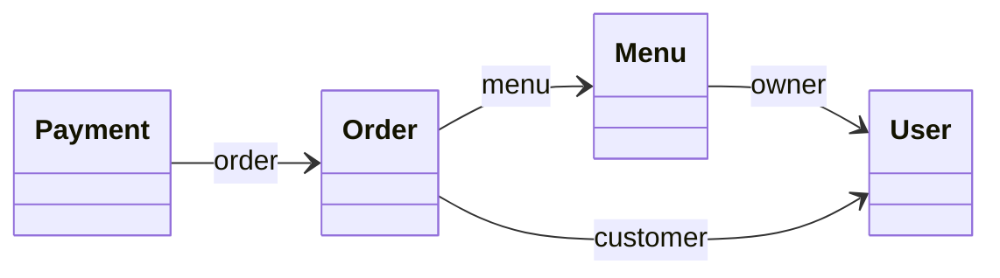
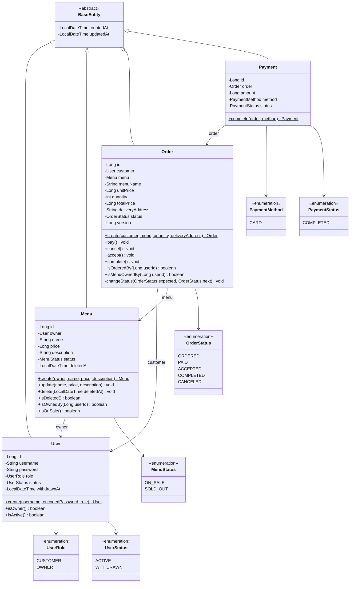
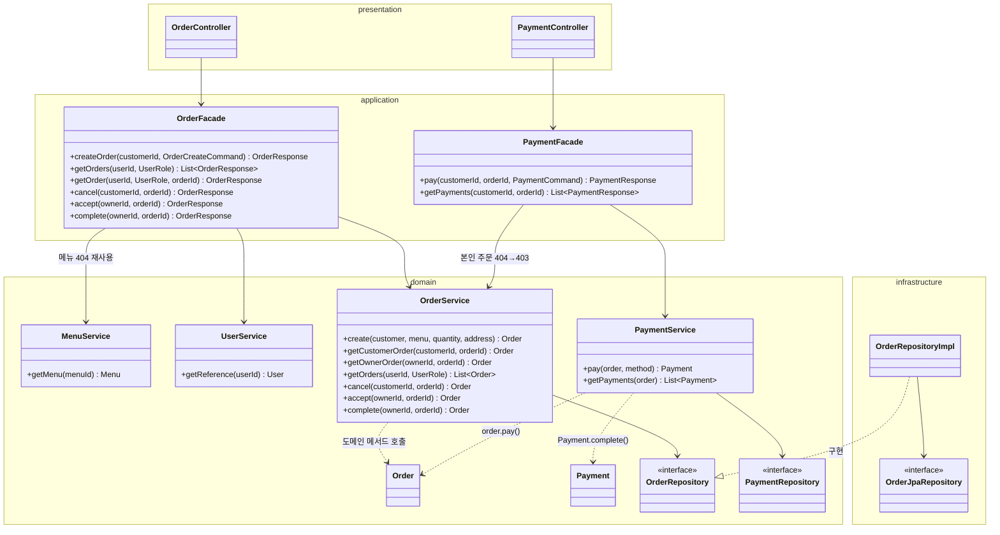

# 04. 클래스 다이어그램

## 변경 이력

| 버전 | 날짜 | 변경 내용 | 관련 요구사항 |
|---|---|---|---|
| v1.0 | 2026-10-07 | 최초 작성 (도메인 모델, 4계층 구조, 결제 책임 분리, 에러 코드) | 01 요구사항 정의서 v1.1, 02 도메인 설계 v1.0 |
| v1.9 | 2026-10-08 | 토큰 발급을 application의 `TokenProvider` 인터페이스로 추상화(D-33). `UserFacade`가 JWT 구현(`JwtProvider`)을 모르게 함. D-31·5.2 갱신 | DIP 점검 |
| v1.8 | 2026-10-08 | 3단계 구현 반영: `OrderService`에 `cancel`·`accept`·`complete`(본인 확인 404→403 후 엔티티 상태 변경) 추가 — `MenuService.update`·`delete`와 같은 모양. 주문 목록 Query Method에 같은 시각 대비 `id` 내림차순(`...OrderByCreatedAtDescIdDesc`) | 구현 |
| v1.7 | 2026-10-08 | domain enum을 application 밖으로 내보내지 않음(D-32): Request·Command·Response의 역할·상태는 문자열. D-13에 `AuthUser.role` 전달 이유 보강 | 구현 후 구조 점검 |
| v1.6 | 2026-10-08 | 2.5단계 리팩터링: application은 Facade(유스케이스 조율·트랜잭션·DTO), domain에 도메인 서비스(조회·404·403·저장)를 둔다(D-31). D-10·D-11·D-12·D-13·D-30, 5·6·7장 갱신. 3·4단계(주문·결제) 설계도 같은 구조로 | 구현 후 구조 점검 |
| v1.5 | 2026-10-07 | 2.5단계 리팩터링: 패키지는 도메인 먼저(D-28), Repository를 domain 인터페이스 + infrastructure 구현으로 분리(D-29), application이 입력(Command)·출력(Response) DTO 소유(D-30). 5장 다이어그램·클래스 목록·Repository 메서드 갱신 | 구현 후 구조 점검 |
| v1.4 | 2026-10-07 | 03 API 명세에 맞춰 DTO 이름 확정, 주문 상태 변경 메서드가 `OrderResponse` 반환, 주문 목록 조회에 `@EntityGraph`(주문자) 적용, C-01·C-02 Service 메서드 추가 | 03 v1.0 |
| v1.3 | 2026-10-07 | `Menu`에 `status`·`isOnSale()`, `MenuStatus` enum 추가. `Order.create()`가 품절 메뉴를 409(`MENU_SOLD_OUT`)로 거절 | 02 v1.3 D-17, 01 v1.4 |
| v1.2 | 2026-10-07 | `User`에 `status`·`withdrawnAt`, `UserStatus` enum, `isActive()` 추가 (로그인 시 활성 회원만 허용) | 02 v1.2 D-16, 01 v1.3 |
| v1.1 | 2026-10-07 | `AuthUser`를 JWT 클레임에서 DB 조회 없이 생성(D-15), `PasswordEncoder`는 `BCryptPasswordEncoder`, 동시 가입 시 UNIQUE 위반을 409로 변환 | 01 v1.2 D-03, 02 v1.1 D-14 |

 

## 1. 요구사항 요약 (근거)

- [01 요구사항 정의서](01-requirements.md): 주문 상태 흐름(5장), 검증 순서 D-01(7.1), 상태 변경 API D-02(7.2)
- [02 도메인 설계](02-domain.md): 테이블 구조, 낙관적 락 D-04, Soft Delete D-05, 스냅샷 D-06
- [07 테스트 전략](07-test-strategy.md): 계층별 테스트 방식, 결정성 원칙(시각 고정)
- `CLAUDE.md`: 4계층 구성과 의존 방향, "비즈니스 규칙은 엔티티에"

> DTO 이름과 Facade 반환 타입은 [03 API 명세서](03-api-spec.md) 7장과 맞춰져 있습니다. 요청 DTO(Request)는 presentation, Facade 입력(Command)·응답 DTO(Response)는 application에 있습니다(D-30).

 

## 2. 쉬운 설명 (한눈에)

> 식당으로 비유하면,
> - **엔티티(domain)는 주문서·메뉴판·영수증**입니다. "결제 전 주문서는 수락할 수 없다" 같은 **규칙은 주문서 스스로** 지킵니다.
> - **도메인 서비스(domain)는 매장별 담당 직원**입니다. 자기 매장의 서류를 찾아오고(조회, 없으면 404), 손님 본인 것인지 확인하고(403), 서류에게 일을 시키고(도메인 메서드 호출), 보관합니다(저장). 규칙을 직접 판단하지 않습니다.
> - **Facade(application)는 총괄 매니저**입니다. "메뉴 담당에게 메뉴 받아 오고 → 주문 담당에게 주문 만들라고 해"처럼 담당 직원들의 **순서만 지휘**하고, 결과를 영수증(응답 DTO)으로 만듭니다. 업무 시작과 마감(트랜잭션)도 매니저가 합니다.
> - **Controller(presentation)는 주문 창구**입니다. 손님의 요청서(Request)를 받아 형식을 확인하고, 직원이 쓰는 작업 지시서(Command)로 옮겨 적어 넘깁니다.
> - **Repository는 창고 담당**입니다. 직원은 "이 주문서 찾아 주세요"라는 **요청 양식(domain 인터페이스)**만 알고, 창고에서 실제로 꺼내 오는 일(DB 접근)은 **창고 직원(infrastructure 구현)**이 합니다.
> - 결제할 때 직원은 **주문서에 "결제 완료"를 시키고 → 영수증을 만듭니다.** 주문서는 영수증의 존재를 모릅니다.

 

## 3. 설계 결정

| ID | 결정점 | 선택 | 이유 | 포기한 것 |
|---|---|---|---|---|
| D-10 | 결제 시 책임 분배 | **결제 도메인 서비스(`PaymentService`)가 순서대로 지시**: `order.pay()` → `Payment.complete(order, method)` → 저장 (v1.6: Service → 도메인 서비스) | 상태 판단은 Order, 기록은 Payment로 책임이 분리되고 각각 따로 테스트할 수 있다. 의존 방향 payment → order 유지 | Service 코드의 간결함 |
| D-11 | 규칙 위반 예외를 던지는 곳 | **상태 규칙(409)은 엔티티가 던지고, 소유 확인(403)·존재 확인(404)은 도메인 서비스가 던진다** (v1.6: Service → 도메인 서비스) | 상태 규칙은 엔티티만으로 판단 가능. 소유 확인은 "누가 요청했는가"라는 맥락이고, 존재 확인은 조회 결과라 Repository를 가진 도메인 서비스의 일이다. 엔티티는 `isOwnedBy()`로 판단 근거만 제공. 도메인 서비스에 두어 여러 Facade가 같은 404·403을 재사용한다 | 엔티티가 모든 검증을 맡는 일관성 |
| D-12 | 현재 시각이 필요한 도메인 메서드 | **시각을 인자로 받는다** (`menu.delete(LocalDateTime)`). 도메인 서비스가 주입받은 `Clock`(`java.time`, Spring 아님)으로 시각을 만든다 | 테스트 결정성 원칙(07). 엔티티 테스트에서 시각을 고정할 수 있다 | `LocalDateTime.now()`를 엔티티 안에서 직접 호출하는 간결함 |
| D-13 | Facade·도메인 서비스에 넘기는 사용자 정보 | **`userId`와 `UserRole`** (domain 타입만) | application·domain이 Security의 인증 객체(`AuthUser`)에 묶이지 않는다. Controller가 `AuthUser`에서 꺼내 넘긴다. `AuthUser.role`은 Security(infrastructure)가 토큰으로 만든 `UserRole`이라, Controller는 `UserRole`을 import하지 않고 값을 전달만 한다(D-32의 예외) | `AuthUser`를 그대로 넘기는 간결함 |
| D-15 | 인증 정보 생성 | `JwtAuthenticationFilter`가 토큰 클레임(`sub`=회원 PK, `username`, `role`)으로 **DB 조회 없이** `AuthUser`를 만든다 | 01 D-03에서 토큰에 회원 PK를 담기로 함. 요청마다 회원 조회 쿼리가 나가지 않는다 | 탈퇴·역할 변경이 토큰 만료(1시간) 전까지 반영되지 않음 — 이번 범위에 탈퇴·역할 변경 기능이 없어 영향 없음 |
| D-28 | 패키지 구성 | **도메인 먼저, 그 안을 계층별로** (`menu/presentation`, `menu/application`, `menu/domain`, `menu/infrastructure`) | 브랜치·TDD가 기능(도메인) 단위라 한 기능의 변경이 한 폴더에 모인다. 도메인 간 의존(payment → order → menu → user)이 import 경로로 바로 보인다. 도메인마다 4계층이 있어 계층 구분도 그대로 지켜진다 | 계층 먼저(`presentation/menu`…) 나눠 4계층이 최상위 폴더에서 바로 보이는 명확함 |
| D-29 | Repository 위치 | **인터페이스는 domain, 구현은 infrastructure.** `domain/MenuRepository`(순수 인터페이스) ← `infrastructure/MenuRepositoryImpl`이 구현하고, 그 안에서 `infrastructure/MenuJpaRepository`(Spring Data)를 사용 | domain·application이 DB 기술(Spring Data JPA)을 모른다. DB 접근이라는 기술 구현이 infrastructure에 모인다. Service 테스트는 domain 인터페이스만 Mock한다. 정렬 컬럼 같은 DB 세부(`createdAt`·`id`)도 구현 안에 둔다 | `JpaRepository`를 상속한 인터페이스 하나로 끝내는 간결함 (도메인마다 클래스 2개 추가) |
| D-30 | Facade 입력·출력 DTO | **application이 소유** (`application/dto`). 입력은 `XxxCommand`, 출력은 `XxxResponse`. Controller가 `request.toCommand()`로 변환하고, Facade가 돌려준 Response를 그대로 응답한다. 도메인 서비스는 DTO를 모르고 값·엔티티만 주고받는다 | 의존이 presentation → application 한 방향이 된다 (전에는 Service가 presentation의 Request·Response를 import해 양방향). HTTP 형식·`@Valid`는 Request에, 유스케이스 입력은 Command에 둔다 | Request를 Service에 그대로 넘기는 간결함. 응답 DTO에 `@JsonFormat`(Jackson 어노테이션)이 application에 남는 것은 허용 |
| D-31 | 유스케이스 흐름과 도메인 작업의 분리 | **application에는 Facade(`XxxFacade`), domain에는 도메인 서비스(`XxxService`).** Facade는 트랜잭션·도메인 서비스 호출 순서·기술(`PasswordEncoder`·`TokenProvider`)·DTO 변환을 맡고, 도메인 서비스는 Repository가 필요한 도메인 단위 작업(조회·404·403·저장, 엔티티에 일 시키기)을 맡는다. 규칙 자체는 계속 엔티티에 둔다 | 주문 생성(메뉴+회원+주문)·결제(주문+결제)처럼 여러 도메인이 엮이는 유스케이스를 Facade가 조율하고, "없는 메뉴 404" 같은 작업을 도메인 서비스 하나로 메뉴·주문이 함께 재사용한다. application = 유스케이스 조율이라는 역할이 코드에 드러난다. 도메인 서비스는 Spring 중 `@Service`(spring-context)만 쓰고 트랜잭션·DTO·Security를 모른다 | 애플리케이션 서비스 하나로 끝내는 간결함. 단순 CRUD에서 Facade가 도메인 서비스를 그대로 부르는 통과용 코드가 생긴다 |
| D-32 | domain enum의 노출 범위 | **domain enum(`UserRole`, `MenuStatus` 등)은 application 밖으로 내보내지 않는다.** Request·Command·Response의 enum 값은 문자열. 받을 때는 presentation이 `@Pattern`으로 허용값을 검증하고 Facade가 `valueOf()`로 바꾼다. 내보낼 때는 `Response.from()`이 `name()`으로 바꾼다. 변환용 공통 메서드는 두지 않는다 | presentation이 domain을 import하지 않는다. domain enum 이름을 바꾸면 변환 코드에서 드러나 API가 조용히 바뀌지 않는다. 잘못된 값은 `fieldErrors`가 담긴 400으로 응답된다(전에는 JSON 변환 실패로 `fieldErrors`가 빈 400). `name()`·`valueOf()`가 이미 표준 공통 메서드라 래퍼가 주는 이득이 없다 | enum 타입을 DTO에 그대로 쓰는 간결함. `@Pattern` 허용값이 enum과 어긋나면 `valueOf()` 실패로 500이 날 수 있음 — enum 값을 바꿀 때 `@Pattern`도 함께 고친다 |
| D-33 | Facade가 쓰는 기술의 추상화 (DIP) | **쓰는 쪽(application)이 인터페이스를 정하고 infrastructure가 구현한다.** 토큰 발급은 `user/application/TokenProvider`(`createToken`, `getExpirationSeconds`)로 정하고 `JwtProvider`(infrastructure)가 구현한다. 토큰 검증(`parse`)은 Security 필터만 쓰므로 `JwtProvider`에만 둔다. `PasswordEncoder`는 이미 인터페이스라 그대로 쓴다 | 의존성 역전 원칙(DIP): 핵심 계층이 기술 세부에 기대지 않는다. Repository(D-29)와 같은 모양이라 구조가 일관된다. 토큰 방식을 바꿔도 `UserFacade`는 바뀌지 않고, Facade 테스트는 인터페이스만 Mock한다. 인터페이스를 쓰는 곳이 `UserFacade` 하나라 `global`이 아닌 `user/application`에 둔다 | 구체 클래스를 바로 쓰는 간결함 (인터페이스 1개 추가). `PasswordEncoder`는 Spring Security가 정한 인터페이스라 완전한 DIP는 아니지만 표준 추상화로 보고 허용 |

 

## 4. 도메인 모델

### 4.1 한눈에 보기

**읽는 법**
- 화살표는 **참조 방향**입니다. 모두 N 쪽에서 1 쪽을 가리키는 단방향 `@ManyToOne`이며, 반대 방향 컬렉션(`@OneToMany`)은 두지 않습니다.
- 그래서 `Order`는 `Payment`를 모르고, `User`는 자신의 메뉴·주문 목록을 갖지 않습니다. 목록이 필요하면 Repository로 조회합니다.

### 4.2 상세

**읽는 법**
- `$`가 붙은 메서드는 **정적 팩토리**입니다. 생성자 대신 이름 있는 메서드로 만들고, 생성 규칙(총액 계산, 스냅샷 복사, 초기 상태)을 그 안에 둡니다. JPA용 기본 생성자는 `protected`로 막습니다.
- `Order`의 상태 변경 메서드 4개는 모두 내부의 `changeStatus(expected, next)`를 거칩니다. 현재 상태가 `expected`가 아니면 `BusinessException(INVALID_ORDER_STATUS)` (409)를 던집니다.
- `Payment.complete(order, method)`는 금액을 **`order.getTotalPrice()`에서 가져옵니다.** 금액을 인자로 받지 않아서, 요청 금액이 끼어들 여지가 없습니다.

### 4.3 엔티티 메서드 명세

| 엔티티 | 메서드 | 규칙 | 실패 |
|---|---|---|---|
| `User` | `create(username, encodedPassword, role)` | 이미 해시된 비밀번호를 받는다 (암호화는 `UserFacade`가 `PasswordEncoder`로). 상태는 `ACTIVE` | — |
| | `isActive()` | `status == ACTIVE`. 로그인 시 도메인 서비스 `UserService`가 확인해 아니면 401(`INVALID_CREDENTIALS`) | — |
| `Menu` | `create(owner, name, price, description)` | 주인은 인자로 받은 사용자 | — |
| | `update(name, price, description)` | 세 값을 모두 교체 | — |
| | `delete(deletedAt)` | `deletedAt` 기록 | — |
| | `isOwnedBy(userId)` | `owner.id == userId` | — |
| | `isOnSale()` | `status == ON_SALE` | — |
| `Order` | `create(customer, menu, quantity, deliveryAddress)` | 메뉴가 판매 중(`isOnSale()`)이어야 한다. `menuName`·`unitPrice`를 메뉴에서 복사, `totalPrice = unitPrice × quantity`, 상태 `ORDERED` | 409 `MENU_SOLD_OUT` |
| | `pay()` | `ORDERED → PAID` | 409 |
| | `cancel()` | `ORDERED → CANCELED` | 409 |
| | `accept()` | `PAID → ACCEPTED` | 409 |
| | `complete()` | `ACCEPTED → COMPLETED` | 409 |
| | `isOrderedBy(userId)` | `customer.id == userId` | — |
| | `isMenuOwnedBy(userId)` | `menu.isOwnedBy(userId)` | — |
| `Payment` | `complete(order, method)` | `amount = order.totalPrice`, 상태 `COMPLETED` | — |

- 입력값 형식(가격 1 이상, 수량 1 이상 등)은 presentation의 `@Valid`가 검증합니다 (01의 검증 순서 ③). 엔티티는 형식 검증을 중복하지 않습니다.

 

## 5. 계층 구조

### 5.1 대표: 주문·결제 도메인

`order`와 `payment`를 대표로 그립니다. `user`, `menu`도 같은 모양입니다(구현 완료).

**읽는 법**
- 의존은 **presentation → application → domain** 한 방향입니다. Controller는 Facade만, Facade는 도메인 서비스만 알고, Repository는 도메인 서비스만 씁니다.
- **Facade는 순서만 조율합니다**(D-31). 주문 생성은 `menuService.getMenu()`(404) → `userService.getReference()` → `orderService.create()`, 결제는 `orderService.getCustomerOrder()`(404 → 403) → `paymentService.pay()`입니다. 트랜잭션은 Facade 메서드 단위입니다(05 D-27).
- **도메인 서비스는 자기 도메인의 Repository만 씁니다.** 다른 도메인의 데이터가 필요하면 Facade가 그 도메인의 서비스로 받아서 넘깁니다. 예: `PaymentService.pay(order, method)`는 주문을 직접 조회하지 않고 인자로 받습니다.
- 도메인 간 의존은 **payment → order → menu → user** 방향만 허용하고, 반대 방향(order가 payment를 아는 것)은 만들지 않습니다.
- **infrastructure는 domain의 Repository 인터페이스를 구현합니다**(D-29). Spring Data JPA(`OrderJpaRepository extends JpaRepository`)는 infrastructure 안에만 있습니다.
- Facade는 application의 `Command`를 받고 `Response`를 돌려줍니다(D-30). Facade·도메인 서비스 메서드는 `userId`·`UserRole`만 받습니다(D-13). Controller가 `@AuthenticationPrincipal AuthUser`에서 꺼내 넘깁니다.

### 5.2 패키지별 클래스 목록

| 패키지 | presentation | application | domain | infrastructure |
|---|---|---|---|---|
| `global` | `GlobalExceptionHandler`, `ErrorResponse` | `dto/PageResponse` | `BaseEntity`, `BusinessException`, `ErrorCode` | `SecurityConfig`, `JpaAuditingConfig`, `ClockConfig`, `JwtProvider`, `JwtAuthenticationFilter`, `AuthUser` |
| `user` | `UserController`, `SignupRequest`, `LoginRequest` | `UserFacade`, `TokenProvider`, `dto/SignupCommand`, `dto/LoginCommand`, `dto/UserResponse`, `dto/LoginResponse` | `User`, `UserRole`, `UserStatus`, `UserService`, `UserRepository` | `UserJpaRepository`, `UserRepositoryImpl` |
| `menu` | `MenuController`, `MenuRequest` | `MenuFacade`, `dto/MenuCommand`, `dto/MenuResponse` | `Menu`, `MenuStatus`, `MenuService`, `MenuRepository` | `MenuJpaRepository`, `MenuRepositoryImpl` |
| `order` | `OrderController`, `OrderCreateRequest` | `OrderFacade`, `dto/OrderCreateCommand`, `dto/OrderResponse` | `Order`, `OrderStatus`, `OrderService`, `OrderRepository` | `OrderJpaRepository`, `OrderRepositoryImpl` |
| `payment` | `PaymentController`, `PaymentRequest` | `PaymentFacade`, `dto/PaymentCommand`, `dto/PaymentResponse` | `Payment`, `PaymentMethod`, `PaymentStatus`, `PaymentService`, `PaymentRepository` | `PaymentJpaRepository`, `PaymentRepositoryImpl` |

- 패키지는 도메인 먼저, 그 안을 계층별로 나눕니다(D-28).
- domain의 `XxxRepository`는 Spring에 의존하지 않는 순수 인터페이스입니다. 단, 페이징 결과 표현인 `Page`(Spring Data Commons)는 허용합니다. `BaseEntity`의 Auditing 리스너와 엔티티의 JPA 매핑 어노테이션도 엔티티 정의의 일부로 보고 domain에 둡니다.
- `UserFacade`는 `PasswordEncoder`와 `TokenProvider`를 사용합니다. 둘 다 **인터페이스**라 Facade는 BCrypt·JWT 구현을 모릅니다. `TokenProvider`는 application이 정하고 infrastructure의 `JwtProvider`가 구현합니다(D-33). domain은 이 둘도 모르므로, 로그인의 비밀번호 대조와 토큰 발급은 도메인 서비스가 아니라 Facade에 있습니다.
- `PasswordEncoder` 빈은 `SecurityConfig`에서 **`BCryptPasswordEncoder`**로 등록합니다. 기본 위임 인코더는 `{bcrypt}` 접두사를 붙여 발제 5-1 ⑥ 확인을 통과하지 못합니다 (02 D-14).
- `AuthUser(userId, username, role)`는 토큰 클레임만으로 만듭니다 (D-15).
- `ClockConfig`는 `Clock` 빈을 등록합니다. 도메인 서비스 `MenuService`가 `menu.delete(LocalDateTime.now(clock))`에 사용합니다(D-12).

### 5.3 Repository 조회 메서드

domain 인터페이스는 **무엇이 필요한지**를 도메인 언어로 정하고, infrastructure의 Spring Data JPA Query Method가 **어떻게 조회할지**를 맡습니다(D-29). Repository 테스트는 오른쪽 Query Method와 구현의 약속(정렬 등)을 검증합니다.

| domain 인터페이스 | 메서드 | infrastructure의 Query Method | 용도 | 관련 기능 |
|---|---|---|---|---|
| `UserRepository` | `existsByUsername(username)` | `existsByUsername` | 가입 시 아이디 중복 확인 | F-01 |
| | `findByUsername(username)` | `findByUsername` | 로그인 | F-02 |
| | `getReferenceById(id)` | `getReferenceById` | 조회 없이 회원 참조 (메뉴 주인, 주문자) | F-03, F-08 |
| `MenuRepository` | `findAllExcludingDeleted(page, size)` | `findAllByDeletedAtIsNull(Pageable)` + 구현이 최신 등록순(`createdAt`↓, `id`↓) 지정 | 삭제되지 않은 메뉴 목록 (페이징) | F-04, C-03 |
| | `findByIdExcludingDeleted(id)` | `findByIdAndDeletedAtIsNull` | 삭제되지 않은 메뉴 단건 (없으면 404) | F-05~F-08 |
| `OrderRepository` | `findAllByCustomerId(customerId)` | `findAllByCustomerIdOrderByCreatedAtDescIdDesc` + `@EntityGraph("customer")` | 손님의 주문 목록 (최신순, 같은 시각이면 `id`↓) | F-09 |
| | `findAllByMenuOwnerId(ownerId)` | `findAllByMenuOwnerIdOrderByCreatedAtDescIdDesc` + `@EntityGraph("customer")` | 사장님 메뉴에 들어온 주문 목록 (최신순, 삭제된 메뉴 포함) | F-09 |
| `PaymentRepository` | `findAllByOrderId(orderId)` | `findAllByOrderId` | 주문의 결제 내역 | C-02 |

- 주문 취소·수락·결제 대상 조회는 `findById`(domain 인터페이스에 선언, `JpaRepository` 기본 메서드에 위임)를 씁니다. 주문은 Soft Delete 대상이 아닙니다.
- 사장님 목록은 `orders.menu.owner.id`를 따라가는 Query Method라 삭제된 메뉴의 주문도 함께 조회됩니다.

 

## 6. 에러 코드

`global/domain/exception/ErrorCode`에 각 기능 브랜치에서 추가합니다.

| ErrorCode | 상태 | 던지는 곳 | 상황 |
|---|---|---|---|
| `DUPLICATE_USERNAME` | 409 | `UserService`, `UserRepositoryImpl` | 이미 있는 아이디로 가입. 동시 가입으로 서비스 검사를 통과해도 DB UNIQUE 위반(`DataIntegrityViolationException`)을 `UserRepositoryImpl`(infrastructure)이 잡아 같은 코드로 변환 — domain이 DB 예외를 모르게 함 |
| `INVALID_CREDENTIALS` | 401 | `UserService`(없음·탈퇴), `UserFacade`(비밀번호 불일치) | 아이디 없음, 비밀번호 불일치, 탈퇴 회원 (구분하지 않음) |
| `MENU_NOT_FOUND` | 404 | `MenuService` (메뉴·주문 Facade가 재사용) | 없거나 삭제된 메뉴 |
| `MENU_ACCESS_DENIED` | 403 | `MenuService` | 다른 사장님의 메뉴 수정·삭제 |
| `MENU_SOLD_OUT` | 409 | `Order` (엔티티, `create`) | 품절 메뉴로 주문 |
| `ORDER_NOT_FOUND` | 404 | `OrderService` (주문·결제 Facade가 재사용) | 없는 주문 |
| `ORDER_ACCESS_DENIED` | 403 | `OrderService` (주문·결제 Facade가 재사용) | 다른 손님의 주문, 다른 사장님 메뉴의 주문 |
| `INVALID_ORDER_STATUS` | 409 | `Order` (엔티티) | 허용되지 않는 상태 변경 |
| `CONCURRENT_MODIFICATION` | 409 | `GlobalExceptionHandler` | 낙관적 락 충돌 (`ObjectOptimisticLockingFailureException`) |

 

## 7. 잠재 리스크

| 리스크 | 상황 | 대응 선택지 |
|---|---|---|
| 지연 로딩 N+1 | 주문 목록에서 주문마다 `customer`나 `menu`를 읽으면 쿼리가 주문 수만큼 추가됨 | 메뉴 정보는 스냅샷으로 해결(D-06). 주문자 아이디(03 D-20)는 목록 Query Method에 `@EntityGraph(attributePaths = "customer")`로 함께 조회. `menuId`는 FK 값이라 프록시 초기화 없이 읽힘 |
| 트랜잭션 밖 지연 로딩 | Controller에서 엔티티의 연관 객체를 읽으면 `LazyInitializationException` | 엔티티 → DTO 변환은 Facade(트랜잭션 안)에서 한다. Controller는 DTO만 다룬다 |
| 도메인 서비스로 규칙 유출 | 도메인 서비스에 상태 판단·계산이 쌓이면 엔티티가 빈 껍데기가 됨 | 도메인 서비스는 조회·404·403·저장과 엔티티 호출만. 상태 전이·금액은 엔티티 메서드(4.3)에 두고 엔티티 테스트로 검증 |
| Facade 통과용 코드 | 단순 CRUD에서 Facade가 도메인 서비스를 그대로 부르기만 함 | 허용(D-31). 단위 테스트는 여러 도메인을 조율하거나 기술을 엮는 Facade만 작성하고, 단순 위임은 E2E가 검증(07) |
| 명세와 코드 불일치 | 구현 중 DTO·메서드 이름이 바뀌면 03·04가 어긋남 | 같은 PR에서 03·04를 함께 갱신 |
