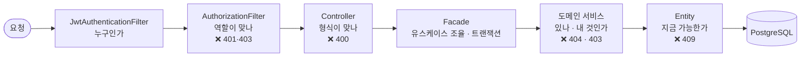
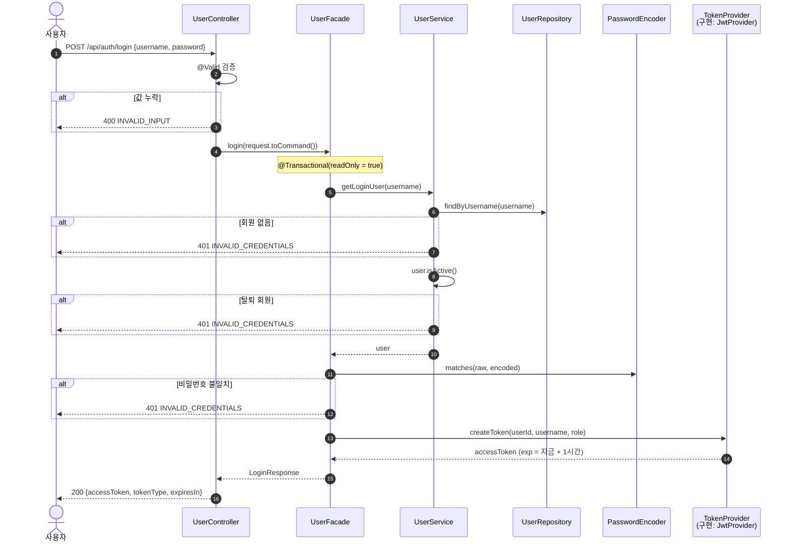
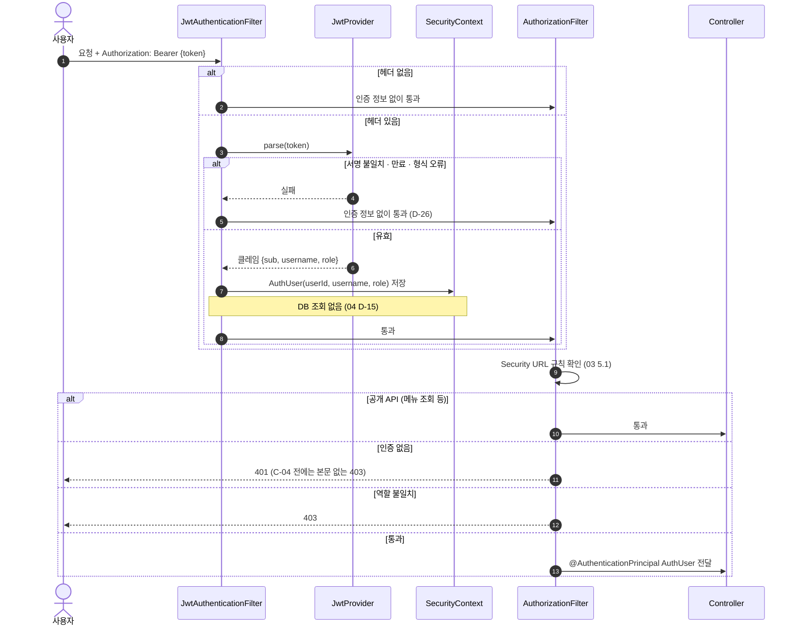
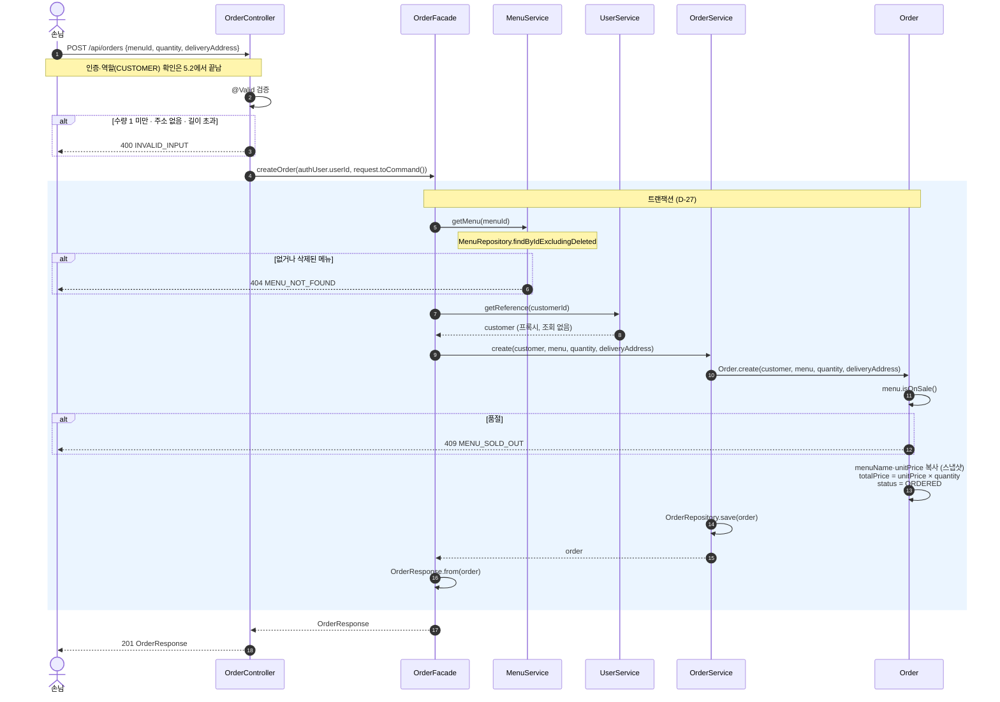
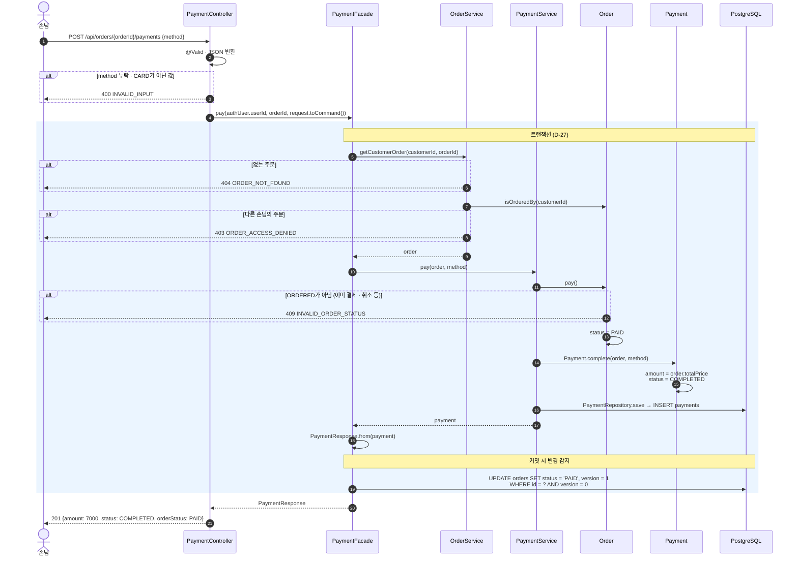
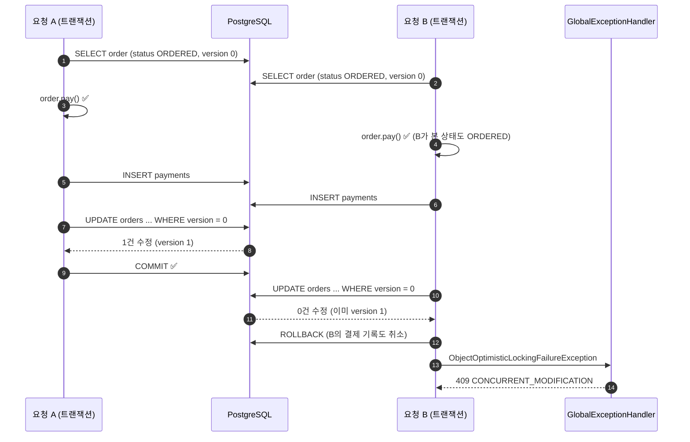

# 05. 시퀀스 다이어그램

## 변경 이력

| 버전 | 날짜 | 변경 내용 | 관련 요구사항 |
|---|---|---|---|
| v1.0 | 2026-10-07 | 최초 작성 (로그인·인증 필터, 주문 생성, 결제 흐름, 트랜잭션 경계) | 01 v1.5, 03 v1.0, 04 v1.4 |
| v1.1 | 2026-10-07 | 04 D-29·D-30 반영: Service에 Command 전달, 메뉴 조회 메서드 이름 `findByIdExcludingDeleted` | 04 v1.5 |
| v1.3 | 2026-10-08 | 04 D-33 반영: 로그인 흐름에서 Facade가 부르는 대상을 `TokenProvider`(구현 `JwtProvider`)로 표기 | 04 v1.9 |
| v1.2 | 2026-10-08 | 04 D-31 반영: 로그인·주문 생성·결제 흐름을 Facade(application) + 도메인 서비스(domain)로 다시 그림. 트랜잭션 경계는 Facade 메서드(D-27) | 04 v1.6 |

 

## 1. 요구사항 요약 (근거)

- [01 요구사항 정의서](01-requirements.md): F-02 로그인, F-08 주문 생성, F-12 결제, 검증 순서 D-01
- [02 도메인 설계](02-domain.md): 낙관적 락 D-04, 스냅샷 D-06
- [03 API 명세서](03-api-spec.md): URL, 상태 코드, 에러 코드
- [04 클래스 다이어그램](04-class-diagram.md): 결제 책임 분배 D-10, 예외를 던지는 곳 D-11, 토큰으로 인증 정보 생성 D-15

**그리는 범위:** 여러 계층과 도메인이 얽히는 흐름 3개만 그립니다. 메뉴 CRUD처럼 "조회 → 소유 확인 → 변경"이 단순한 흐름은 아래 3개의 패턴과 같아서 생략합니다.

 

## 2. 쉬운 설명 (한눈에)

> 요청 하나가 서버에 들어오면 **입구 경비(필터) → 창구(Controller) → 총괄 매니저(Facade) → 담당 직원(도메인 서비스) → 서류(엔티티) → 보관함(DB)** 순서로 지나갑니다.
>
> - **경비**는 출입증(토큰)을 보고 "누구인지"만 확인합니다. 역할이 맞지 않으면 여기서 돌려보냅니다.
> - **창구**는 요청서 형식이 맞는지 봅니다 (빈칸, 길이).
> - **총괄 매니저**는 어느 담당 직원에게 어떤 순서로 일을 맡길지 정하고, 결과를 영수증(응답 DTO)으로 만듭니다.
> - **담당 직원**은 자기 매장(도메인)의 서류를 찾아오고(404), 본인 것인지 확인하고(403), 서류에게 일을 시킵니다.
> - **서류**는 지금 상태에서 그 일이 가능한지 스스로 판단합니다(409).
> - 총괄 매니저의 일이 끝나면 한꺼번에 보관함에 저장합니다. 중간에 하나라도 실패하면 **전부 없던 일**이 됩니다(트랜잭션).

 

## 3. 설계 결정

| ID | 결정점 | 선택 | 이유 | 포기한 것 |
|---|---|---|---|---|
| D-26 | 잘못된 토큰을 받은 필터의 동작 | **인증 정보를 비운 채 다음 필터로 넘긴다.** 거절은 인가 단계(URL 규칙)가 한다 | 만료된 토큰을 들고 공개 API(메뉴 조회)를 호출해도 막히지 않는다. 인증과 인가의 책임이 나뉜다 | 필터에서 즉시 401을 응답하는 명확함 (C-04에서 응답 형식만 통일) |
| D-27 | 트랜잭션 경계 | **Facade 메서드 단위** (`@Transactional`, v1.2에서 Service → Facade). 조회 메서드는 `readOnly = true`. 도메인 서비스는 트랜잭션을 열지 않고 Facade의 트랜잭션에 참여한다. 엔티티 → DTO 변환도 트랜잭션 안에서 한다 | 여러 도메인 서비스를 부르는 유스케이스(결제 = 주문 상태 변경 + 결제 기록 저장)가 함께 커밋·롤백된다. 지연 로딩이 트랜잭션 안에서 끝난다 | Controller까지 트랜잭션을 늘리는 방식 (OSIV에 기대지 않음) |

 

## 4. 공통 흐름

모든 요청이 지나가는 순서와, 각 단계가 응답하는 상태 코드입니다 ([01 D-01](01-requirements.md#71-검증-순서-d-01)).

**읽는 법**
- 왼쪽 단계에서 실패하면 오른쪽 단계는 실행되지 않습니다. 그래서 응답 코드의 우선순위가 이 순서와 같습니다.
- 필터는 "누구인가"만 정하고 거절하지 않습니다(D-26). 거절은 바로 다음 `AuthorizationFilter`가 03의 Security URL 규칙으로 합니다.

 

## 5. 로그인과 인증 필터 (F-02)

### 5.1 로그인 — 토큰 발급

**읽는 법**
- 실패 이유 세 가지(회원 없음, 탈퇴, 비밀번호 불일치)가 **모두 같은 응답**입니다. 어느 이유인지 알려주지 않아서 아이디 존재 여부가 새지 않습니다.
- 회원을 찾는 일(Repository 필요)은 도메인 서비스가, 비밀번호 대조와 토큰 발급(보안 기술)은 Facade가 맡습니다. domain이 `PasswordEncoder`·`TokenProvider`를 모르게 하기 위해서입니다(04 D-31). Facade도 두 인터페이스만 알고 BCrypt·JWT 구현은 모릅니다(04 D-33).
- 로그인 경로(`/api/auth/**`)는 인증이 필요 없어서 인증 필터가 아무것도 하지 않고 통과시킵니다.
- 만료 시각은 `JwtProvider`가 주입받은 `Clock`으로 계산합니다. 테스트에서 시각을 고정해 만료를 검증할 수 있습니다(07 결정성 원칙).

### 5.2 인증이 필요한 요청 — 토큰 검증

**읽는 법**
- 필터는 **거절하지 않습니다**(D-26). 잘못된 토큰이어도 "인증 안 된 요청"으로 넘기고, 거절 여부는 `AuthorizationFilter`가 URL 규칙으로 판단합니다. 그래서 만료 토큰으로도 메뉴 조회는 됩니다.
- 토큰이 유효하면 클레임만으로 `AuthUser`를 만듭니다. 요청마다 회원 테이블을 조회하지 않습니다.
- Controller는 `AuthUser`에서 `userId`와 `role`을 꺼내 Facade에 넘깁니다(04 D-13).

 

## 6. 주문 생성 (F-08)

**읽는 법**
- **총액과 주문자는 요청에 없습니다.** 총액은 `Order.create()` 안에서 DB의 메뉴 가격으로, 주문자는 토큰의 `userId`로 정해집니다.
- Facade는 **메뉴·회원·주문 세 도메인 서비스를 순서대로 부르기만** 합니다. 메뉴 404는 메뉴 API와 같은 `menuService.getMenu()`를 재사용합니다(04 D-31).
- 404(메뉴 없음)는 도메인 서비스가, 409(품절)는 엔티티가 던집니다(04 D-11). 삭제 확인이 품절 확인보다 먼저입니다.
- 주문자는 `getReference`로 **조회 없이 참조**만 만듭니다. 응답의 `customerUsername`을 읽을 때 한 번 조회됩니다. 토큰이 유효하면 회원은 존재하므로 404 검사가 필요 없습니다.

 

## 7. 결제 (F-12)

### 7.1 정상 흐름과 검증 실패

**읽는 법**
- 검사 순서가 **404 → 403 → 409**입니다. 남의 주문이면 결제 여부와 상관없이 403이라, 남의 주문 상태가 새지 않습니다(01 D-01). 404·403은 주문 도메인 서비스가, 409는 엔티티가 던집니다.
- 결제 도메인 서비스가 **`order.pay()` → `Payment.complete()`** 순서로 지시합니다(04 D-10). 주문 상태는 Order가, 금액과 결제 기록은 Payment가 책임집니다. 금액은 요청이 아니라 `order.totalPrice`에서 옵니다.
- Facade는 "본인 주문 가져오기(주문 도메인) → 결제하기(결제 도메인)" 순서만 조율하고 트랜잭션을 엽니다. 주문 상태 변경과 결제 기록 저장이 **한 트랜잭션**이라 함께 커밋·롤백됩니다.
- 주문의 `UPDATE`는 Facade 메서드가 끝나고 **커밋할 때** 실행됩니다(변경 감지). 이때 `version` 조건이 함께 붙습니다.

### 7.2 동시 결제 — 낙관적 락 충돌

같은 주문에 결제 요청 두 개가 거의 동시에 들어온 경우입니다([02 D-04](02-domain.md)).

**읽는 법**
- 두 요청 모두 `order.pay()` 검사를 통과합니다. 상태 검사만으로는 막을 수 없는 상황입니다.
- 막는 것은 **`UPDATE`의 `version` 조건**입니다. 나중에 커밋하는 B는 0건 수정이 되어 예외가 나고, **같은 트랜잭션의 결제 기록까지 롤백**됩니다. 결제 완료 기록은 항상 1건입니다.
- 이 예외는 Facade 밖(커밋 시점)에서 나므로 `GlobalExceptionHandler`가 409로 바꿔야 합니다. 처리하지 않으면 500이 됩니다(04 6장).

 

## 8. 잠재 리스크

| 리스크 | 상황 | 대응 |
|---|---|---|
| 트랜잭션 밖 지연 로딩 | Controller에서 엔티티 연관 객체를 읽으면 `LazyInitializationException` | DTO 변환을 Facade 안에서 끝낸다(D-27). `spring.jpa.open-in-view: false`로 꺼서 실수를 테스트에서 바로 드러나게 한다 |
| 낙관적 락 예외가 500 | 커밋 시점 예외를 처리하지 않으면 500 | `GlobalExceptionHandler`에 전용 핸들러 (`feat/payment`에서 TDD) |
| 동시성 테스트의 어려움 | 7.2 상황은 단위 테스트로 재현할 수 없음 | E2E에서 같은 주문에 결제 요청 2개를 동시에 보내고(스레드 2개), 결제 기록이 1건인지 확인 |
| 잘못된 토큰의 조용한 통과 | 필터가 거절하지 않아 토큰 문제를 알아채기 어려움 (D-26) | 토큰 파싱 실패를 DEBUG 로그로 남긴다. C-04에서 인증 실패 응답에 이유를 담는다 |
