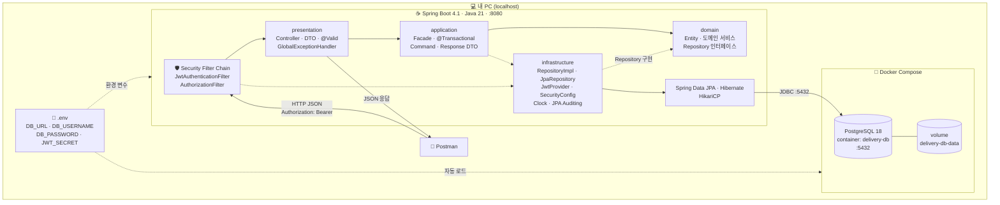
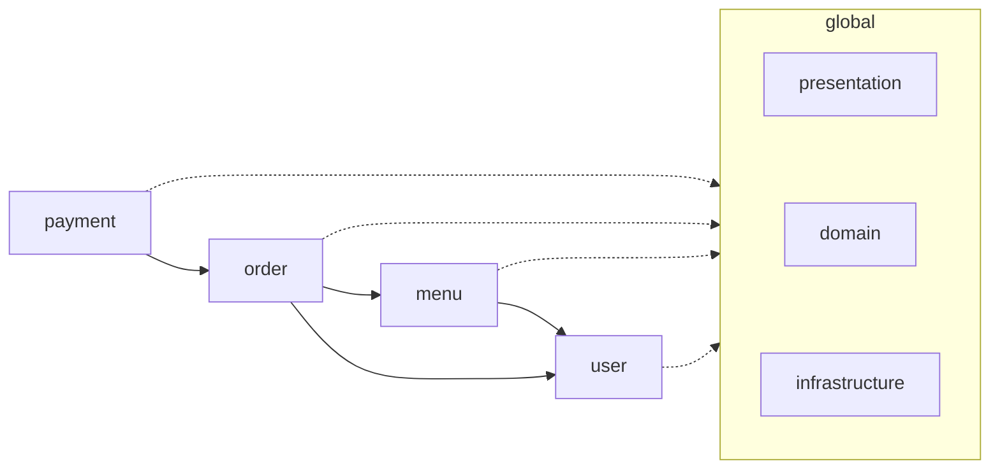
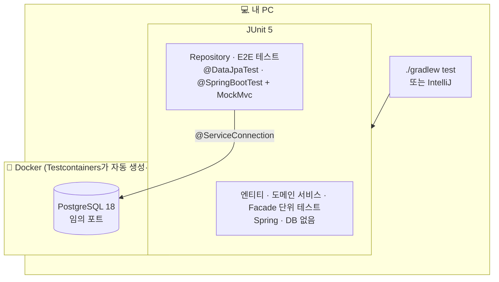

# 06. 아키텍처 구성도

## 변경 이력

| 버전 | 날짜 | 변경 내용 | 관련 요구사항 |
|---|---|---|---|
| v1.0 | 2026-10-07 | 최초 작성 (실행 환경, 요청 흐름, 4계층 구조, 테스트 환경) | 발제 4-4, 01~05, 07 |
| v1.1 | 2026-10-07 | DB 접근을 infrastructure로 이동(04 D-29): 구성도·계층 표·패키지 구조 갱신. 도메인마다 `infrastructure` 패키지를 둔다 | 04 v1.5 |
| v1.2 | 2026-10-08 | application은 Facade, domain에 도메인 서비스(04 D-31): 구성도·계층 표 갱신 | 04 v1.6 |

 

## 1. 요구사항 요약 (근거)

- 발제 4-4: 배포하지 않으므로 **내 PC 기준**으로 요청이 흐르는 경로를 그린다
- 발제 1-3: Spring Boot 기반 모놀리식 애플리케이션
- `CLAUDE.md`, [04 클래스 다이어그램](04-class-diagram.md): 4계층 레이어드 아키텍처
- [05 시퀀스 다이어그램](05-sequence-diagram.md): 필터 → Controller → Facade → 도메인 서비스 → Entity 흐름
- [07 테스트 전략](07-test-strategy.md): Testcontainers

 

## 2. 쉬운 설명 (한눈에)

> 모든 것이 **내 컴퓨터 한 대** 안에서 돌아갑니다.
>
> - **Postman**이 손님·사장님 역할을 대신해 요청을 보냅니다.
> - **Spring Boot 앱**(서버 하나)이 요청을 받아 처리합니다. 앱 안은 4개의 층으로 나뉘어 있습니다.
> - **PostgreSQL**은 Docker 컨테이너 안에서 돌아가며 데이터를 저장합니다.
> - 비밀번호 같은 비밀값은 코드가 아니라 **`.env` 파일**에 있고, 앱과 DB가 같은 파일을 읽습니다.

 

## 3. 실행 환경 (개발)

**읽는 법**
- 요청은 **Security 필터 → presentation → application → domain** 순서로 내려가고, 응답은 presentation에서 JSON으로 나갑니다. 층을 건너뛰는 호출은 없습니다.
- 점선은 "사용한다"는 의미입니다. application과 Security 필터가 infrastructure(JWT, 설정)를 쓰고, **domain은 infrastructure를 모릅니다.**
- DB 접근은 infrastructure가 맡습니다. domain은 Repository **인터페이스**만 정하고, infrastructure의 `RepositoryImpl`이 그 인터페이스를 구현하며 Spring Data JPA로 DB에 접근합니다(04 D-29). application은 domain 인터페이스만 알아서 DB 기술이 바뀌어도 영향을 받지 않습니다.
- `.env` 하나를 앱(IntelliJ 실행 설정 또는 셸)과 Docker Compose가 함께 읽습니다. 이 파일은 git에 올리지 않습니다.

 

## 4. 계층과 책임

| 계층 | 책임 | 주요 구성 | 응답하는 실패 |
|---|---|---|---|
| Security Filter Chain | 토큰으로 "누구인가" 확인, URL 규칙으로 역할 검사 | `JwtAuthenticationFilter`, `AuthorizationFilter` | 401, 403(역할) |
| presentation | HTTP 요청·응답, 입력 형식 검증, 예외 → 에러 응답 변환 | Controller, 요청 DTO(Request), `GlobalExceptionHandler` | 400 |
| application | 유스케이스 흐름 조율(도메인 서비스 호출 순서), 트랜잭션, 기술 처리(암호화·토큰), DTO 변환 | Facade, 입력(Command)·응답(Response) DTO | — |
| domain | 비즈니스 규칙 (상태 전이, 총액 계산, 스냅샷), 도메인 단위 작업 (조회·존재·소유 확인·저장) | Entity, enum, 도메인 서비스, Repository 인터페이스 | 404, 403(소유), 409 |
| infrastructure | 기술 구현 (DB 접근, 인증, 설정) | `XxxRepositoryImpl`·`XxxJpaRepository`, `JwtProvider`, `SecurityConfig`, `ClockConfig`, `JpaAuditingConfig` | — |

의존 방향: presentation → application → domain. infrastructure는 application·Security에서 사용하며, domain은 infrastructure를 참조하지 않습니다.

 

## 5. 패키지 구조와 도메인 간 의존

**읽는 법**
- 도메인 패키지끼리는 **payment → order → menu → user** 한 방향으로만 의존합니다. order가 payment를 알거나 user가 menu를 아는 역방향 의존은 없어서 순환이 생기지 않습니다.
- 모든 도메인은 `global`(BaseEntity, 예외, Security, JWT)을 사용합니다.
- 각 도메인 패키지 안은 `presentation · application · domain · infrastructure` 4개 패키지로 나뉩니다(04 D-28). 도메인의 `infrastructure`에는 그 도메인의 DB 접근 구현(`XxxJpaRepository`, `XxxRepositoryImpl`)이 들어갑니다.

 

## 6. 테스트 환경

**읽는 법**
- 테스트용 DB는 개발용 `delivery-db`와 **별개**입니다. Testcontainers가 테스트 시작 시 띄우고 끝나면 지웁니다. 개발 데이터와 섞이지 않습니다.
- 접속 정보는 `@ServiceConnection`이 자동으로 연결하므로 테스트에는 `.env`가 필요 없습니다. Docker Desktop만 켜져 있으면 됩니다.
- 단위 테스트는 Docker 없이도 실행됩니다.

 

## 7. 포트와 설정 요약

| 구성 요소 | 주소 | 설정 위치 |
|---|---|---|
| Spring Boot | `http://localhost:8080` | 기본값 |
| PostgreSQL (개발) | `localhost:5432`, DB `delivery` | `docker-compose.yml`, `.env` |
| PostgreSQL (테스트) | 임의 포트 | Testcontainers 자동 |
| 애플리케이션 설정 | — | `src/main/resources/application.yml` (값은 `${환경 변수}`) |
| 테스트 설정 | — | `src/test/resources/application-test.yml` + `@ActiveProfiles("test")` |

 

## 8. 잠재 리스크

| 리스크 | 상황 | 대응 |
|---|---|---|
| 5432 포트 충돌 | PC에 PostgreSQL이 따로 설치되어 있으면 Docker 대신 응답함 (발제 3-5 ④) | `docker-compose.yml` 포트를 `5433:5432`로, `.env`의 `DB_URL`도 함께 변경 |
| Docker 미실행 | 앱이 DB에 접속하지 못하고, DB가 필요한 테스트가 전부 실패 | 작업 시작 시 `docker ps`, `docker compose up -d` |
| `.env` 누락 | 앱 실행 시 `${DB_URL}` 등을 해석하지 못해 시작 실패 | `cp .env.example .env`, IntelliJ 실행 설정에 환경 변수 등록 (README) |
| 단일 서버 | 모놀리식 한 대라 확장·장애 대응 구조가 없음 | 과제 범위(로컬 실행)에서는 의도된 구조 (발제 1-3) |
