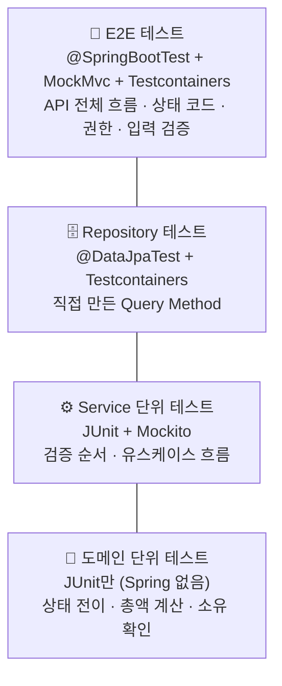
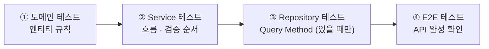

# 07. 테스트 전략

## 변경 이력

| 버전 | 날짜 | 변경 내용 | 관련 요구사항 |
|---|---|---|---|
| v1.0 | 2026-10-07 | 최초 작성 (TDD 방식, 테스트 DB, 계층별 테스트 방식, 진행 순서 결정) | 01 요구사항 정의서 전체 |
| v1.1 | 2026-10-07 | 6장 테스트 작성 규칙 보강 (동작 검증, 리터럴 기대값, 독립성·결정성, 픽스처, TDD 진행 원칙) | CLAUDE.md 테스트 코드 작성 원칙 |
| v1.2 | 2026-10-07 | 발제 대조 검증 반영: 5-1 ⑥ DB 직접 확인 항목의 자동 검증(4.5), `/error`·CSRF 함정 검증을 E2E 필수 항목으로 추가 | 발제 3-5 ②, 5-1 ⑥ |

<br>

## 1. 쉬운 설명 (한눈에)

> 이 프로젝트는 **테스트를 먼저 쓰고, 그 테스트를 통과하는 코드를 나중에 씁니다(TDD).**
>
> 자동차를 만든다면,
> - **부품 검사(단위 테스트):** 브레이크·엔진을 하나씩 떼어서 빠르게 검사합니다. → 엔티티, Service
> - **주행 시험(E2E 테스트):** 다 조립한 차를 실제 도로(진짜 DB)에서 몰아 봅니다. → API 전체
>
> 부품부터 만들고 검사한 뒤(안에서 바깥으로), 마지막에 주행 시험으로 "기능 완성"을 확인합니다.

<br>

## 2. 결정 사항

| # | 결정점 | 선택 | 이유 | 포기한 것 |
|---|---|---|---|---|
| T-01 | 개발 방식 | **TDD** (Red → Green → Refactor) | 요구사항(01)의 규칙·실패 조건을 테스트로 먼저 고정하고 구현 | 구현부터 빠르게 작성하는 속도 |
| T-02 | 테스트 DB | **Testcontainers (PostgreSQL 18)** | 예약어 테이블, enum CHECK 제약 등 발제 3-5의 함정이 PostgreSQL 고유 동작이라 진짜 DB로 검증해야 함. 개발 DB와 데이터가 섞이지 않고 `.env` 없이 실행됨 | H2의 속도, Docker 없이 테스트하는 편의 |
| T-03 | Service 테스트 | **Mockito 단위 테스트** | Repository를 가짜로 두고 404 → 403 → 409 검증 순서와 흐름만 빠르게 검증 | 실제 DB와 함께 도는 Service 검증 (E2E가 대신 담당) |
| T-04 | API 테스트 | **E2E (`@SpringBootTest` + MockMvc)** | Security 필터·URL 권한·`@Valid`·예외 핸들러·DB까지 실제 조합으로 검증. 발제 5-1 시나리오를 자동화해 Postman 수동 확인을 대체 | `@WebMvcTest`의 빠른 Controller 단독 테스트 |
| T-05 | 진행 순서 | **안에서 바깥으로 (Inside-out)** | 비즈니스 규칙이 엔티티에 모여 있어(4계층) 핵심 규칙이 가장 먼저 단단해짐. 작은 단위부터 초록불을 보며 진행 | 처음부터 "기능 완성" 기준을 세우는 Outside-in의 명확함 |

<br>

## 3. 테스트 구성



**읽는 법**
- 아래로 갈수록 **빠르고 많이**, 위로 갈수록 **느리고 적게** 씁니다.
- 규칙 하나를 여러 층에서 중복 검증하지 않습니다. 예를 들어 "결제 전 주문은 수락 불가"는 **도메인 테스트**에서 검증하고, E2E에서는 대표 케이스 하나로 409 응답만 확인합니다.

<br>

## 4. 계층별 테스트 방식

| 대상 | 검증하는 것 | 도구 | Spring | DB | 위치 |
|---|---|---|---|---|---|
| **domain** | 상태 전이와 409, 총액 계산, 소유 확인, Soft Delete | JUnit 5 + AssertJ | ❌ | ❌ | `{도메인}/domain/*Test` |
| **application** | 404 → 403 → 409 순서, 저장·호출 여부, 응답 DTO 변환 | JUnit 5 + Mockito + AssertJ | ❌ | ❌ (Mock) | `{도메인}/application/*ServiceTest` |
| **repository** | 직접 작성한 Query Method 결과 (삭제 메뉴 제외, 역할별 주문 목록) | `@DataJpaTest` | 일부 | ✅ Testcontainers | `{도메인}/domain/*RepositoryTest` |
| **API (E2E)** | 성공 응답과 상태 코드, 400 입력 검증, 401·403 권한, 응답에 비밀번호 없음 | `@SpringBootTest` + MockMvc | ✅ 전체 | ✅ Testcontainers | `{도메인}/presentation/*ApiTest` |
| **infrastructure** | JWT 발급·검증·만료 | JUnit 5 | ❌ | ❌ | `global/infrastructure/security/*Test` |

### 4.1 domain — 순수 단위 테스트

- Spring 없이 `new`로 엔티티를 만들어 메서드를 호출합니다.
- 01의 상태 다이어그램에서 **허용되는 전이와 허용되지 않는 전이를 모두** 테스트합니다.
- 예: `ORDERED` 주문에 `pay()` → `PAID` / `PAID` 주문에 `cancel()` → `BusinessException` (409)

### 4.2 application — Mockito 단위 테스트

- `@ExtendWith(MockitoExtension.class)`로 Repository, `PasswordEncoder`, `JwtProvider`만 Mock으로 둡니다.
- **엔티티는 Mock으로 만들지 않습니다.** 진짜 엔티티를 써야 도메인 규칙이 함께 동작합니다. ID가 필요하면 테스트 픽스처에서 설정합니다.
- 01의 [검증 순서(D-01)](01-requirements.md#71-검증-순서-d-01) ④~⑥(404 → 403 → 409)을 이 계층에서 검증합니다. 특히 **여러 규칙을 동시에 어긴 경우**(남의 주문 + 이미 결제됨 → 403)를 반드시 포함합니다.

### 4.3 repository — `@DataJpaTest`

- Spring Data가 만들어 주는 기본 메서드(`save`, `findById`)는 테스트하지 않습니다.
- **직접 이름을 지은 Query Method만** 테스트합니다. 예: 삭제되지 않은 메뉴만 조회, 사장님 메뉴에 들어온 주문 조회
- `@DataJpaTest`는 기본적으로 내장 DB로 바꾸려 하므로, Testcontainers PostgreSQL을 쓰도록 설정합니다.

### 4.4 API — E2E 테스트

- `@SpringBootTest` + `@AutoConfigureMockMvc`로 Security 필터 체인을 포함한 전체 앱을 띄웁니다.
- 01의 [검증 순서](01-requirements.md#71-검증-순서-d-01) ①~③(401 → 403 역할 → 400)은 Security·`@Valid`·예외 핸들러가 담당하므로 **E2E에서만 검증할 수 있습니다.**
- 기능별로 **성공 케이스 + 401·403(역할)·400 케이스 + 대표 404·409 케이스 하나**를 작성합니다.
- 발제 5-1의 시나리오(#1~#39)가 기능별 E2E 테스트에 모두 포함되도록 합니다.

**Security 함정 검증 (발제 3-5 ②)** — 모든 기능에서 아래가 성립해야 합니다. Security 설정 실수를 테스트가 바로 잡습니다.
- 400·404·409 응답이 **본문 없는 403으로 바뀌지 않는다** (`/error` 허용 누락 검출)
- 올바른 토큰을 가진 POST·PATCH·DELETE 요청이 **403으로 막히지 않는다** (CSRF 비활성화 누락 검출)
- 응답 본문이 공통 에러 형식(`ErrorResponse`)이다

**데이터 격리**
- 테스트에 `@Transactional`을 붙여 롤백하지 **않습니다.** 롤백 방식은 지연 로딩 오류(`LazyInitializationException`)와 커밋 시점의 제약 위반을 숨깁니다.
- 대신 **각 테스트 전에 모든 테이블을 비웁니다** (TRUNCATE).

### 4.5 발제 5-1 ⑥ DB 직접 확인 항목의 자동 검증

발제는 psql로 테이블을 직접 열어 확인하라고 합니다. 같은 내용을 테스트로 자동화해 두고, 제출 전 psql 확인은 최종 점검으로만 합니다.

| 발제 확인 항목 | 자동 검증 방법 | 테스트 |
|---|---|---|
| 비밀번호가 `$2`로 시작하는 BCrypt 값 | 가입 후 저장된 `password`가 `$2`로 시작하고 평문과 다름 | 회원가입 E2E 또는 `UserRepository` 테스트 |
| 모든 테이블에 생성·수정 시각이 채워짐 | 저장 후 `createdAt`·`updatedAt`이 null이 아님, 수정 후 `updatedAt`이 바뀜 | 엔티티별 `@DataJpaTest` (Auditing 설정 포함) |
| 결제 테이블에 결제 기록 1건 (7,000원) | 결제 후 해당 주문의 결제 기록이 1건이고 금액이 총액과 같음, 재결제·동시 결제 후에도 1건 | 결제 E2E |
| 주문 상태·역할이 문자열로 저장 | 네이티브 쿼리로 `status`·`role` 컬럼 값을 읽어 `"PAID"`·`"OWNER"` 같은 문자열인지 확인 | `@DataJpaTest` |
| 삭제된 메뉴의 행이 남아 있고 삭제 표시만 됨 | 삭제 후 네이티브 쿼리로 행이 존재하고 `deleted_at`이 채워졌는지 확인 | 메뉴 삭제 E2E 또는 `@DataJpaTest` |

<br>

## 5. TDD 진행 순서 (기능 하나 기준)

안에서 바깥으로 진행합니다. 각 단계는 **Red → Green → Refactor**입니다.



| 단계 | 🔴 Red (실패 테스트 먼저) | 🟢 Green (최소 구현) |
|---|---|---|
| ① 도메인 | 엔티티 메서드 테스트 | 엔티티, enum, 도메인 메서드 |
| ② Service | 성공·404·403·409 테스트 | Service, Repository 인터페이스(메서드 선언만), ErrorCode |
| ③ Repository | Query Method 결과 테스트 | Query Method 이름 정리, 엔티티 매핑 수정 |
| ④ E2E | 상태 코드·권한·입력 검증·응답 모양 테스트 | Controller, DTO, Security URL 규칙 |

**예: F-12 결제**
1. `OrderTest`: `ORDERED`에서 `pay()` → `PAID` / `PAID`·`CANCELED`에서 `pay()` → 409
2. `PaymentServiceTest`: 없는 주문 404 → 남의 주문 403 → 이미 결제 409 → 성공 시 결제 저장과 상태 변경
3. (해당 Query Method 없음 → 생략)
4. `PaymentApiTest`: 성공 201과 금액, OWNER 403, 카드 외 수단 400, 남의 주문 403, 재결제 409

<br>

## 6. 테스트 작성 규칙

> **쉬운 설명:** 좋은 테스트는 **"무엇이 깨졌는지 이름만 보고 알 수 있고, 언제 돌려도 같은 결과가 나오는"** 테스트입니다.

### 6.1 형식

| 항목 | 규칙 |
|---|---|
| 위치·이름 | 프로덕션 클래스와 같은 패키지에 `{클래스명}Test`. E2E는 `{도메인}/presentation/{도메인}ApiTest` |
| 표시 이름 | `@DisplayName`에 **한국어 문장**으로 기대 동작을 적는다. 예: `"결제완료가 아닌 주문은 수락할 수 없다"` |
| 구조 | 본문을 `// given` · `// when` · `// then`으로 나눈다 |
| 검증 | AssertJ(`assertThat`, `assertThatThrownBy`)를 쓴다 |
| 예외 검증 | 예외 타입뿐 아니라 **`ErrorCode`까지** 확인한다 |

### 6.2 내용

| 원칙 | 규칙 | 이유 |
|---|---|---|
| 하나의 동작 | 테스트 하나는 동작 하나만 검증한다 | 실패했을 때 원인이 하나로 좁혀진다 |
| 실패 케이스 | 01의 기능별 실패 조건(상태 코드)마다 대응하는 테스트를 둔다 | 이 과제의 핵심은 "막아야 할 것을 막는 것" |
| 동작 검증 | 반환값·상태 변화를 먼저 확인하고, Mockito `verify`는 호출 여부 자체가 요구사항일 때만 쓴다 (예: 검증 실패 시 `save` 미호출) | 내부 구현을 바꿀 때마다 테스트가 깨지는 것을 막는다 |
| 리터럴 기대값 | 기대값을 직접 적는다 (`price * quantity` ❌, `7000` ⭕). 테스트에 `if`·`for`를 넣지 않는다 | 프로덕션 로직을 테스트에서 다시 계산하면 같은 버그를 함께 가진다 |
| 독립성 | 실행 순서나 다른 테스트가 남긴 데이터에 의존하지 않는다 | 단독 실행과 전체 실행의 결과가 같아야 한다 |
| 결정성 | 현재 시각·난수에 의존하는 코드는 `Clock` 등을 주입받게 만들어 테스트에서 고정한다 (예: JWT 만료) | 언제 돌려도 같은 결과가 나와야 한다 |

### 6.3 픽스처와 프로덕션 코드

- 반복되는 엔티티 생성은 도메인별 픽스처 클래스(예: `MenuFixture`)로 모으고, 테스트에서는 **그 테스트에 중요한 값만** 드러낸다
- 테스트를 위해 프로덕션 코드에 setter나 `public` 생성자를 추가하지 않는다. ID 설정 등은 픽스처에서 `ReflectionTestUtils`로 처리한다

### 6.4 TDD 진행

- Red 단계에서 테스트가 **기대한 이유로** 실패하는지 확인한다 (컴파일 에러가 아니라 단언 실패)
- 테스트를 통과시키려고 테스트를 고치지 않는다. 요구사항이 바뀐 것이면 01을 먼저 고치고 테스트를 고친다
- 테스트 케이스는 01의 기능별 규칙과 실패 조건에서 도출한다. 테스트로 표현하기 어려운 요구사항이 있으면 01을 먼저 고친다

<br>

## 7. 실행 환경

- **Docker Desktop이 켜져 있어야 합니다.** Testcontainers가 테스트용 PostgreSQL 컨테이너를 띄웁니다.
- 테스트는 `.env` 없이 실행됩니다. DB 접속 정보는 Testcontainers가, JWT 비밀키는 테스트 전용 설정이 제공합니다.
- 컨테이너는 **테스트 전체에서 하나를 재사용**합니다. 테스트 클래스마다 새로 띄우지 않습니다.

```bash
./gradlew test                                                   # 전체
./gradlew test --tests "com.example.delivery.order.domain.OrderTest"   # 단일 클래스
```

### 구현 시 설정할 것 (첫 구현 브랜치 `feat/auth`에서)

- 의존성 추가: `spring-boot-testcontainers`, Testcontainers PostgreSQL 모듈, Testcontainers JUnit 모듈
- `@ServiceConnection`으로 PostgreSQL 컨테이너를 연결하는 공통 테스트 설정 클래스
- 테스트 전용 설정 파일 `src/test/resources/application-test.yml` + `@ActiveProfiles("test")`
  - ⚠️ 이름을 `application.yml`로 만들면 main의 설정 파일을 **통째로 가려서** 읽히지 않습니다. 반드시 프로파일 파일로 분리합니다.
- E2E 공통 부모 클래스: 컨테이너 연결, MockMvc, 각 테스트 전 테이블 비우기
- 기존 `DeliveryApplicationTests`도 Testcontainers 설정을 쓰도록 변경

<br>

## 8. 잠재 리스크

| 리스크 | 상황 | 대응 |
|---|---|---|
| Docker 미실행 | Docker Desktop이 꺼져 있으면 DB가 필요한 테스트가 전부 실패 | 실패 메시지에서 원인이 바로 보이도록, 작업 시작 시 `docker ps` 확인을 습관화 |
| E2E 속도 | 테스트가 늘면 전체 실행이 느려짐 | 컨테이너 재사용, Spring 컨텍스트 캐시가 깨지지 않도록 E2E 설정을 공통 부모 클래스로 통일. TDD 중에는 단일 클래스만 실행 |
| Mock 과다 | Service 테스트에서 "가짜가 이렇게 답하면"이 많아지면 실제와 어긋날 수 있음 | 엔티티는 진짜 객체 사용, Mock은 Repository·외부 기술(암호화·JWT)로 제한. 실제 조합은 E2E가 확인 |
| 중복 검증 | 같은 규칙을 여러 계층에서 반복 테스트하면 규칙 변경 시 수정할 곳이 늘어남 | 3장의 원칙대로 규칙은 가장 안쪽 계층에서, 바깥 계층은 대표 케이스만 |
